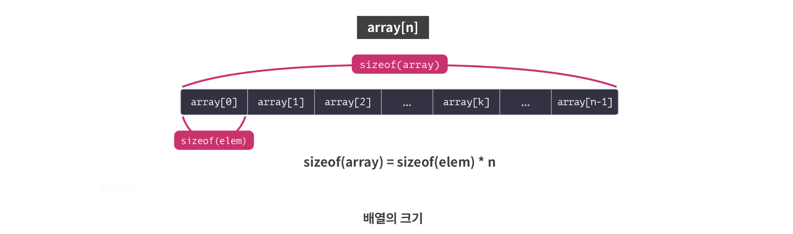

# Out-of-Bounds (OOB)

# Memory Corruption: Out of Bounds

## 서론

---

프로그램을 개발할 때 같은 자료형의 변수나 객체를 여러 개 관리해야 하면, 이들을 요소로 하는 배열을 선언하여 사용해야 한다. 배열은 같은 자료형의 **요소(Element)**들로 이루어져 있는데, 각 요소의 위치를 **인덱스(Index)**라고 한다.

처음 C언어에서 배열을 배우고, 사용할 때, 배열의 인덱스와 관련된 부분에서 자주 실수를 한다. 현실에서는 첫 번째 요소라고 할 것을 프로그래밍 할 때는 0번째 요소라고 해야 하는 데서 발생하는 인지적 실수, 사소한 부등호 실수, 그리고 인덱스를 벗어나서 참조할 수 있어도 경고를 띄어주지 않는 컴파일러 등이 주요 원인일 것이다.

위와 같은 실수는 운이 좋으면 프로그램의 비정상 종료로 그치지만, 때에 따라 치명적인 취약점의 원인이 될 수도 있다. 대표적으로는 배열의 임의 인덱스에 접근할 수 있는 **Out of Bounds (OOB)**가 있다.

OOB 취약점이 발생하는 코드의 유형과 OOB를 공격해서 얻을 수 있는 효과에 대해 살펴보자.

# Out of Bounds

## 배열의 속성

---

배열은 연속된 메모리 공간을 점유하며, 배열이 점유하는 공간의 크기는 요소의 개수와 요소 자료형의 크기를 곱한 값이 된다. 흔히, 배열이 포함하는 요소의 개수를 **배열의 길이 (Length)**라고도 부른다.



배열 각 요소의 주소는 배열의 주소, 요소의 인덱스, 요소 자료형의 크기를 이용하여 계산된다.


## Out of Bounds

---

OOB는 요소를 참조할 때, 인덱스 값이 음수이거나 배열의 길이를 벗어날 때 발생한다. 개발자가 인덱스의 범위에 대한 검사를 명시적으로 프로그래밍하지 않으면, 프로세스는 앞서 배운 식을 따라 요소의 주소를 계산할 뿐, 계산한 주소가 배열의 범위 안에 있는지 검사하지 않는다.

따라서 만약 사용자가 배열 참조에 사용되는 인덱스를 임의 값으로 설정할 수 있다면, 배열의 주소로부터 특정 오프셋에 있는 메모리의 값을 참조할 수 있다. 이를 배열의 범위를 벗어나는 참조라 하여 **Out of Bounds**라고 부른다.

## Proof-of-Concept

---

다음 코드는 OOB의 이해를 돕기 위한 코드이다. 예제는 int형 변수 10개를 요소로 하는 배열 arr을 선언하고, 다양한 인덱스를 사용하여 배열 내부와 외부의 주소들을 출력한다.

```c
// Name: oob.c
// Compile: gcc -o oob oob.c

#include <stdio.h>

int main() {
  int arr[10];

  printf("In Bound: \n");
  printf("arr: %p\n", arr);
  printf("arr[0]: %p\n\n", &arr[0]);

  printf("Out of Bounds: \n");
  printf("arr[-1]: %p\n", &arr[-1]);
  printf("arr[100]: %p\n", &arr[100]);

  return 0;
}

```

예제를 컴파일하고 실행하면, 다음과 같은 결과를 확인할 수 있다.

```c
$ gcc -o oob oob.c
$ ./oob
In Bound:
arr: 0x7ffebc778b00
arr[0]: 0x7ffebc778b00

Out of Bounds:
arr[-1]: 0x7ffebc778afc
arr[100]: 0x7ffebc778c90
```

결과에서 주목해야 할 것은 다음과 같다.

먼저, 컴파일러(gcc)는 배열의 범위를 명백히 벗어나는 -1과 100을 인덱스로 사용했음에도 아무런 경고를 띄어주지 않았다. 즉, OOB를 방지하는 것은 전적으로 개발자의 몫이다.

다음으로, arr[0]와 arr[100]의 주소 차이가 0x7ffebc778c90 - 0x7ffebc778b00 = 0x190 = 100 * 4이다. 배열의 범위를 벗어난 인덱스를 참조해도 앞서 살펴본 식을 그대로 사용함을 알 수 있다.

OOB를 이용한 임의 주소 읽기와 임의 주소 쓰기를 살펴보자.

## 임의 주소 읽기

---

OOB로 임의 주소의 값을 읽으려면, 읽으려는 변수와 배열의 오프셋을 알아야 한다. 배열과 변수가 같은 세그먼트에 할당되어 있다면, 둘 사이의 오프셋은 항상 일정하므로 디버깅을 통해 쉽게 알아낼 수 있다. 만약 같은 세그먼트가 아니라면, 다른 취약점을 통해 두 변수의 주소를 구하고, 차이를 계산해야 한다.

**다음 코드**는 인덱스에 대한 검증이 미흡해 임의 주소 읽기가 가능한 예제 코드이다. 4인 배열 docs를 참조하는데, 인덱스 값이 4보다 큰지만 검사하고, 음수인지는 검사하지 않는다.

```c
// Name: oob_read.c
// Compile: gcc -o oob_read oob_read.c

#include <stdio.h>
#include <stdlib.h>
#include <unistd.h>

char secret[256];

int read_secret() {
  FILE *fp;

  if ((fp = fopen("secret.txt", "r")) == NULL) {
    fprintf(stderr, "`secret.txt` does not exist");
    return -1;
  }

  fgets(secret, sizeof(secret), fp);
  fclose(fp);

  return 0;
}

int main() {
  char *docs[] = {"COMPANY INFORMATION", "MEMBER LIST", "MEMBER SALARY",
                  "COMMUNITY"};
  char *secret_code = secret;
  int idx;

  // Read the secret file
  if (read_secret() != 0) {
    exit(-1);
  }

  // Exploit OOB to print the secret
  puts("What do you want to read?");
  for (int i = 0; i < 4; i++) {
    printf("%d. %s\n", i + 1, docs[i]);
  }
  printf("> ");
  scanf("%d", &idx);

  if (idx > 4) {
    printf("Detect out-of-bounds");
    exit(-1);
  }

  puts(docs[idx - 1]);
  return 0;
}
```

docs와 secret_code은 모두 스택에 할당되어 있으므로, docs에 대한 OOB를 이용하면 secret_code의 값을 쉽게 읽을 수 있다.

```c
$ echo "THIS IS SECRET" > ./secret.txt
$ ./oob_read
What do you want to read?
1. COMPANY INFORMATION
2. MEMBER LIST
3. MEMBER SALARY
4. COMMUNITY
> 0
THIS IS SECRET
```

## 임의 주소에 쓰기

---

OOB를 이용하면 임의 주소에 값을 쓰는 것도 가능하다.

**다음 코드**는 인덱스에 대한 검증이 미흡해 임의 주소에 값을 쓸 수 있는 예제이다. 코드를 살펴보면, 24바이트 크기의 Student 구조체 10개를 포함하는 배열 stu와 isAdmin를 전역변수로 선언한다. 그리고 사용자로부터 인덱스를 입력받아 인덱스에 해당하는 Student 구조체의 attending에 1을 대입한다.

```c
// Name: oob_write.c
// Compile: gcc -o oob_write oob_write.c

#include <stdio.h>
#include <stdlib.h>

struct Student {
  long attending;
  char *name;
  long age;
};

struct Student stu[10];
int isAdmin;

int main() {
  unsigned int idx;

  // Exploit OOB to read the secret
  puts("Who is present?");
  printf("(1-10)> ");
  scanf("%u", &idx);

  stu[idx - 1].attending = 1;

  if (isAdmin) printf("Access granted.\n");
  return 0;
}
```

예제 코드의 마지막 부분을 보면 isAdmin이 참인지 검사하는 부분이 있다. 해당 변수에 값을 직접 쓰는 부분은 없지만, 코드에 OOB 취약점이 있으므로 이를 이용하여 isAdmin의 값을 조작할 수 있다.

이를 위해 디버거로 stu와 isAdmin의 주소를 확인해보면, isAdmin이 stu보다 240바이트 높은 주소에 있음을 알 수 있다.

```c
pwndbg> i var isAdmin
Non-debugging symbols:
0x0000000000201130  isAdmin
pwndbg> i var stu
Non-debugging symbols:
0x0000000000201040  stu
pwndbg> print 0x201130-0x201040
$1 = 240
```

배열을 구성하는 Student 구조체의 크기가 24바이트이므로, 10번째 인덱스를 참조하면 isAdmin을 조작할 수 있다.

```c
$ ./oob_write
Who is present?
(1-10)> 11
Access granted.
```

# 실습

## Exploit Tech

---

[Exploit Tech: Out of Bounds](Exploit%20Tech%20Out%20of%20Bounds%20363a9179d3af805b9f08f78d30442e9f.md)