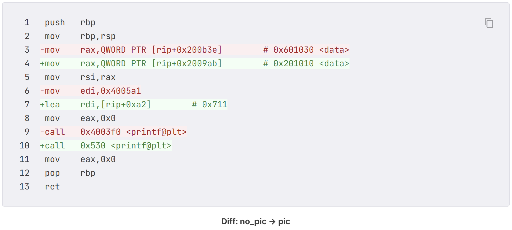

# PIE & RELRO 우회

# Background: PIE

## 들어가며

---

ASLR이 적용되면 바이너리가 실행될 때마다 **스택, 힙, 공유 라이브러리** 등이 무작위 주소에 매핑되므로, 공격자가 이 영역들을 공격에 활용하기 어려워진다. 하지만 실행 파일의 main() 이나 전역 변수 등이 위치한 주소는 항상 고정된 상태일 수 있다.

PIE는 ASLR이 실행 파일에도 적용되게 해주는 기술이다.

* 이 기술은 보안성 향상을 위해 도입된 것은 아니지만, ASLR과 맞물려 공격을 더욱 어렵게 만들었다.

# PIC와 PIE

## PIC

---

### PIC

리눅스에서 ELF는 실행 파일(Executable)과 공유 오브젝트(Shared Object, SO)로 두가지가 존재한다.
실행 파일은 일반적인 실행 파일이고, 공유 오브젝트는 libc.so와 같은 라이브러리 파일이 해당한다.

공유 오브젝트는 기본적으로 재배치(Relocation)가 가능하도록 설계되어 있다.
재배치가 가능하다는 것은 메모리의 어느 주소에 적재되어도 코드의 의미가 훼손되지 않음을 의미하며, **Position-Independent Code (PIC)**라고 부른다.

재배치란 고정된 base 주소에서 랜덤한 offset 만큼 이동하는 것을 말한다. 즉, 코드의 주소는 바뀌지만 코드 내부의 주소들의 상대적인 위치는 변하지 않는다.

```c
$ file addr
addr: ELF 64-bit LSB executable

$ file /lib/x86_64-linux-gnu/libc.so.6
/lib/x86_64-linux-gnu/libc.so.6: ELF 64-bit LSB shared object
```

위의 예시에서 addr 파일은 executable 이고, libc.so.6 파일은 shared object이다.
참고로 LSB는 Least Significant Byte (firts)의 약자로 리틀 엔디안임을 의미한다.

gcc는 기본적으로 실행 파일을 만들 때 PIC 컴파일을 지원한다. PIC가 적용된 바이너리와 아닌 바이너리를 비교해보자.

```c
// Name: pic.c
// Compile: gcc -o pic pic.c
// 	      : gcc -o no_pic pic.c -fno-pic -no-pie
#include <stdio.h>
char *data = "Hello World!";
int main() {
  printf("%s", data);
  return 0;
}
```

### PIC 코드 분석

no_pic 와 pic 의 main 함수를 비교해보면, %s 문자열을 printf에 전달하는 방식이 다르다.
no_pic 에서는 0x402011라는 절대 주소로 문자열을 참조한다.
pic 에서는 문자열의 주소를 rip+0xeaf로 참조하고 있다.

```c
dong@BOOK-52INSEHGSS:~/dreamhack/PIE_RELRO/PIE$ gdb no_pic
pwndbg> x/s 0x402011
0x402011:       "%s"
```

```c
dong@BOOK-52INSEHGSS:~/dreamhack/PIE_RELRO/PIE$ gdb pic
pwndbg> x/s 0x2011
0x2011: "%s"
```

바이너리가 매핑되는 주소가 바뀌면 0x402011에 있던 데이터도 함께 이동하므로 no_pic의 코드는 제대로 실행되지 못한다. 그러나 pic의 코드는 rip를 기준으로 데이터를 상대 참조(Relative Addressing)하기 때문에 바이너리가 무작위 주소에 매핑돼도 제대로 실행될 수 있다.

→ 재배치를 하였을 때 0x402011처럼 절대 주소로 참조하게 되면 offset만큼의 차이가 나게된다. 하지만 rip+0xeaf처럼 상대 주소로 참조하게 되면 상대적인 위치들은 변하지 않았으므로 성공적으로 실행할 수 있다.



Dreamhack의 코드라서 위의 주소와는 살짝 다름

## PIE

---

### PIE

**Position-Independent Executable(PIE)**은 무작위 주소에 매핑되도 실행가능한 실행파일을 뜻한다.

ASLR이 도입되기 전에는 실행 파일을 무작위 주소에 매핑할 필요가 없었다. 그래서 리눅스의 실행 파일 형식은 재배치를 고려하지 않고 설계되었다. 이후에 ASLR이 도입되었을 때는 실행 파일도 무작위 주소에 매핑될 수 있게 하고 싶었으니나, 이미 널리 사용되는 실행 파일의 형식을 변경하면 호환성 문제가 발생할 것이 분명했다. 그래서 개발자들은 원래 재배치가 가능했던 공유 오브젝트를 실행 파일로 사용하기로 했다.

**역사적으로,** ELF 형식이 설계된 것은 1990년대 초반이다. 그때는 ASLR이라는 개념 자체가 없었고, 실행 파일을 재배치할 이유도 없었다. 공유 라이브러리의 경우 여러 프로세스가 각각 다른 주소에 매핑해서 써야했기에 ET_DYN이 필요했지만, 실행 파일은 고정 주소로 충분했다.

**성능적으로,** ET_EXEC가 ET_DYN에 비해 유리한 점이 있었다. 특히 당시 32비트 기반에서 차이가 컸다.

- 절대 주소로 접근하기 때문에 GOT 간접 참조가 필요 없음
- 32 비트 x86에는 RIP-relative 주소 지정이 없어서, PIC 코드는 GOT 포인터를 레지스터(보통 ebx)에 유지했어야 했음 → 이미 부족한 범용 레지스터가 하나 줄어드는 오버헤드
- 로드 시 재배치가 필요 없으니 프로그램 실행이 더 빠름

두번째 이유가 크다
64 비트에서는 RIP-relative 주소 지정이 가능하다.

```c
mov eax, [rip+0x2f14]   # 현재 명령어 기준으로 GOT 엔트리 바로 접근
```

32 비트에서는 eip 기준 상대 주소 접근 자체가 설계적으로 불가능하다. 그래서 GOT 주소를 알아내기 위해서는 우회가 필요하다.

```c
call __x86.get_pc_thunk.bx   # 현재 eip 값을 ebx에 넣는 트릭
add  ebx, 0x2e8b              # ebx += 오프셋 → ebx = GOT 베이스 주소
mov  eax, [ebx+0x10]          # GOT를 통해 전역 변수 접근
mov  ecx, [ebx+0x14]          # 또 GOT 통해 접근

; mov [eip+0x10] 같은 명령은 불가능
```

이렇게 ebx에 GOT 주소를 넣고 써야하므로, ebx를 다른 용도로 사용할 수 없다.
32 비트 x86의 범용 레지스터가 eax, ebx, ecx, edx, esi, edi 6개인데(esp, ebp 제외), 여기서 ebx 하나를 GOT 전용으로 뺏기면 오버헤드가 너무 커진다.

따라서 일반적으로 PIE를 적용하게 된 것은 10년 정도 밖에 되지 않았다.
그 이전에는 보안에 민감한 바이너리 (ssh 등)만 선택적으로 PIE로 컴파일 하였다.

- Fedora 23 (2015) - GCC 5와 binutils 2.26을 기반으로 PIE를 모든 어플리케이션에 기본 적용
https://fedoraproject.org/wiki/Changes/Modernise_GCC_Flags
- Ubuntu 16.10 (2016) - 64비트 아키텍처(amd64, ppc64el, s390x)에서 PIE를 기본 적용
https://documentation.ubuntu.com/security/security-features/process-memory/compiler-flags/
- Ubuntu 17.10 (2017) - 보안 이점이 충분히 크다고 판단해 모든 아키텍처에서 PIE를 기본 활성화
- Debian 10 (2019) - PIE 기본 적용

전면 적용이 늦어진 이유는 x86-64에서 copy relocation 지원 덕에 PIE 오버헤드가 사실상 0이 된 이후에야 기본값으로 전환할 명분이 생겼기 때문이다.

리눅스의 기본 실행 파일 중 하나인 /bin/ls 의 파일 헤더를 살펴보면, Type 이 공유 오브젝트(Shared Object)를 나타내는 DYN(ET_DYN)임을 알 수 있다.

```c
$ readelf -h /bin/ls
ELF Header:
  Magic:   7f 45 4c 46 02 01 01 00 00 00 00 00 00 00 00 00
  Class:                             ELF64
  Data:                              2's complement, little endian
  Version:                           1 (current)
  OS/ABI:                            UNIX - System V
  ABI Version:                       0
  Type:                              DYN (Position-Independent Executable file)
  Machine:                           Advanced Micro Devices X86-64
  Version:                           0x1
  Entry point address:               0x6ab0
  Start of program headers:          64 (bytes into file)
  Start of section headers:          136224 (bytes into file)
  Flags:                             0x0
  Size of this header:               64 (bytes)
  Size of program headers:           56 (bytes)
  Number of program headers:         13
  Size of section headers:           64 (bytes)
  Number of section headers:         31
  Section header string table index: 30
```

*참고로 gcc가 기본적으로 PIE를 적용하므로 일반적인 실행파일도 readelf -h로 확인해보면 Type이 DYN이다. 근데 file 명령어로 확인해보면 shared object와 executable을 구분하는 것을 알 수 있는데, 이는 PT_INTERP 세그먼트의 유무로 구분한다.

- ET_DYN + PT_INTERP 있음 → pie executable
- ET_DYN + PT_INTERP 없음 → shared object
- ET_EXEC → executable

*PT_INTERP : 이 바이너리를 실행시키기 위해서는 동적 링커를 사용하라고 커널에게 알려주는 세그먼트이다. 실행 파일은 커널이 직접 실행해야하므로 동적 링커 경로가 필요하고, 공유 라이브러리는 이미 동적 링커에 의해 로드 되는 입장이므로 필요 없다.

### PIE on ASLR

PIE는 재배치가 가능하므로, ASLR이 적용된 시스템에서는 실행 파일도 무작위 주소에 적재된다.
PIE는 재배치가 가능하게 하는 것이고 ASLR이 랜덤화하는 것이므로, ASLR을 적용하지 않으면 PIE가 적용되어 있어도 바이너리가 무작위 주소에 적재되지 않는다.
PIE를 적용하여 컴파일해서 직접 확인해보자.

```c
// Name: addr.c
#include <dlfcn.h>
#include <stdio.h>
#include <stdlib.h>

int main() {
    char buf_stack[0x10];                   // 스택 영역의 버퍼
    char *buf_heap = (char *)malloc(0x10);  // 힙 영역의 버퍼

    printf("buf_stack addr: %p\n", buf_stack);
    printf("buf_heap addr: %p\n", buf_heap);
    printf("libc_base addr: %p\n",
        *(void **)dlopen("libc.so.6", RTLD_LAZY));  // 라이브러리 영역 주소

    printf("printf addr: %p\n",
        dlsym(dlopen("libc.so.6", RTLD_LAZY),
        "printf"));  // 라이브러리 영역의 함수 주소
    printf("main addr: %p\n", main);  // 코드 영역의 함수 주소
}
```

위 코드를 다음의 명령어를 통해 컴파일하면 PIE가 적용된 프로그램인 pie를 얻을 수 있다.

```c
$ gcc -o pie addr.c -ldl
```

컴파일한 프로그램인 pie를 여러 번 직접 실행해보면 다음과 같이 main()의 주소가 실행마다 바뀐다.

```c
dong@BOOK-52INSEHGSS:~/dreamhack/PIE_RELRO/PIE$ pie
buf_stack addr: 0x7fff373f8230
buf_heap addr: 0x575dbe78f2a0
libc_base addr: 0x78d8ae400000
printf addr: 0x78d8ae460100
main addr: 0x575dabb141c9

dong@BOOK-52INSEHGSS:~/dreamhack/PIE_RELRO/PIE$ pie
buf_stack addr: 0x7fff34691130
buf_heap addr: 0x5ca378f0e2a0
libc_base addr: 0x7dc1ea200000
printf addr: 0x7dc1ea260100
main addr: 0x5ca34faa41c9

dong@BOOK-52INSEHGSS:~/dreamhack/PIE_RELRO/PIE$ pie
buf_stack addr: 0x7ffcbf303860
buf_heap addr: 0x5896097a52a0
libc_base addr: 0x7ac2f2200000
printf addr: 0x7ac2f2260100
main addr: 0x5895e6e0c1c9
```

# PIE 우회

## PIE 우회

---

### 코드 베이스 구하기

ASLR 환경에서 PIE가 적용된 바이너리는 실행될 때 마다 다른 주소에 적재된다. 그래서 코드 영역의 가젯을 사용하거나, 데이터 영역에 접근하려면 바이너리가 적재된 주소를 알아야 한다. 이 주소를 PIE 베이스, 또는 코드 베이스라고 한다. 코드 베이스를 구하려면 라이브러리의 베이스 주소를 구할 때 처럼 코드 영역의 임의 주소를 읽고, 그 주소에서 오프셋을 빼야한다.

### Partial Overwrite

코드 베이스를 구하기 어렵다면 반환 주소의 일부 바이트만 덮는 공격을 고려해볼 수 있다. 이러한 공격 기법을 Partial Overwrite 이라고 부른다. 일반적으로 함수의 반환 주소는 호출 함수(Caller)의 내부를 가리킨다. 특정 함수의 호출 관계는 정적 분석 또는 동적 분석으로 쉽게 확인할 수 있으므로, 공격자는 반환 주소를 예상할 수 있다.

ASLR의 특성 상, 코드 영역의 주소도 하위 12바이트 값은 항상 같다. 따라서 사용하려는 코드 가젯의 주소가 반환 주소와 하위 한 바이트만 다르다면, 이 값만 덮어서 원하는 코드를 실행시킬 수 있다. 그러나 만약 두 바이트 이상이 다른 주소로 실행 흐름을 옮기고자 한다면, ASLR로 뒤섞이는 주소를 맞춰야 하므로 브루트 포싱이 필요하며, 공격이 확률에 따라 성공하게 된다.

다음과 같은 예를 보자

```c
0000000000001149 <win>:
    1149: ...           ← 여기로 가고 싶음

0000000000001180 <vuln>:
    1180: push   rbp
    ...
    11a5: ret

00000000000011b0 <main>:
    11b0: push   rbp
    11b1: mov    rbp, rsp
    11b4: call   1180 <vuln>
    11b9: mov    eax, 0x0        ← vuln의 반환 주소는 여기 (0x11b9)
    11be: pop    rbp
    11bf: ret
```

만약 vuln 함수의 ret 값의 하위 1바이트를 b9이 아닌 49로 바꾼다면 win 함수에 진입할 수 있다.

이때 리틀 엔디안 방식으로 스택에 저장된 ret의 주소는 다음과 같을 것이다.

```c
스택에 저장된 반환 주소 (리틀 엔디안):
b9 51 55 55 55 55 00 00
^^
하위 1바이트만 덮으면 여기만 바뀜
```

따라서 스택 버퍼 오버플로우로 하위 1 바이트만 변경할 수 있다. 만약 2 바이트를 변경해야한다면 5 부분에 해당하는 숫자를 맞춰야 하므로 브루트 포싱이 되어 확률적으로 성공하는 것이다. 16진수이므로 1/16 

# Background: RELRO

## 서론

---

리눅스의 라이브러리는 ELF가 GOT이라는 테이블을 활용하여 반복되는 라이브러리 함수의 호출 비용을 줄인다. GOT를 구하는 방법은 다양한데 그 중 하나는 함수가 처음 호출될 때 함수의 주소를 구하고, 이를 GOT에 적는 **Lazy Binding**이 있다.

Lazy Binding을 하는 바이너리는 실행 중에 GOT 테이블을 업데이트할 수 있어야 하므로 GOT가 존재하는 메모리 영역에 쓰기 권한이 부여된다. 그런데 이는 바이너리를 취약하게 만드는 원인이 된다.

또한, ELF의 데이터 세그먼트에는 프로세스의 초기화 및 종료와 관련된 .init_array, .fini_array가 있다. 이 영역들은 프로세스의 시작과 종료에 실행할 함수들의 주소를 저장하고 있는데, 여기에도 공격자가 임의로 값을 쓸 수 있다면, 프로세스의 실행 흐름이 조작될 수 있다.

이러한 문제를 해결하기 위해서 프로세스의 데이터 세그먼트를 보호하는 **RELocation-Read-Only (RELRO)**을 개발하였다. RELRO는 쓰기 권한이 불필요한 데이터 세그먼트에 쓰기 권한을 제거한다.

RELRO는 RELRO를 적용하는 범위에 따라 두 가지로 구분된다.

- Partial RELRO : .init_array / .fini_array 를 읽기 전용으로 바꾼다.
- Full RELRO : GOT 까지 읽기 전용으로 바꾼다.

# RELRO

## Partial RELRO

---

### Partial RELRO 확인 코드

**Partial Relro**와 **Full Relro**의 차이를 확인하기 위해 하단의 코드를 예제 코드로 사용해보자.
자신의 메모리 맵을 출력하는 바이너리 소스 코드이다.

```c
// Name: relro.c
// Compile: gcc -o prelro relro.c -no-pie -fno-PIE
#include <stdio.h>
#include <stdlib.h>
#include <unistd.h>
int main() {
  FILE *fp;
  char ch;
  fp = fopen("/proc/self/maps", "r");
  while (1) {
    ch = fgetc(fp);
    if (ch == EOF) break;
    putchar(ch);
  }
  return 0;
}
```

실습 환경의 gcc는 Full RELRO를 기본 적용하며, PIE를 해제하면 Partial RELRO를 적용한다.
바이너리의 RELRO 여부는 checksec 으로 검사 할 수 있다.

```c
$ gcc -o prelro -no-pie relro.c

$ checksec prelro
[*] '/home/dreamhack/prelro'
    Arch:     amd64-64-little
    RELRO:    Partial RELRO
    Stack:    No canary found
    NX:       NX enabled
    PIE:      No PIE (0x400000)
```

### Partial RELRO 권한

prelro를 실행해보면, 0x404000 부터 0x405000 까지의 주소에는 쓰기 권한이 있음을 확인할 수 있다.

```c
dong@BOOK-52INSEHGSS:~/dreamhack/PIE_RELRO/RELRO$ prelro
00400000-00401000 r--p 00000000 08:30 92029                              /home/dong/dreamhack/PIE_RELRO/RELRO/prelro
00401000-00402000 r-xp 00001000 08:30 92029                              /home/dong/dreamhack/PIE_RELRO/RELRO/prelro
00402000-00403000 r--p 00002000 08:30 92029                              /home/dong/dreamhack/PIE_RELRO/RELRO/prelro
00403000-00404000 r--p 00002000 08:30 92029                              /home/dong/dreamhack/PIE_RELRO/RELRO/prelro
00404000-00405000 rw-p 00003000 08:30 92029                              /home/dong/dreamhack/PIE_RELRO/RELRO/prelro
06f32000-06f53000 rw-p 00000000 00:00 0                                  [heap]
70202d200000-70202d228000 r--p 00000000 08:30 37332                      /usr/lib/x86_64-linux-gnu/libc.so.6
70202d228000-70202d3b0000 r-xp 00028000 08:30 37332                      /usr/lib/x86_64-linux-gnu/libc.so.6
70202d3b0000-70202d3ff000 r--p 001b0000 08:30 37332                      /usr/lib/x86_64-linux-gnu/libc.so.6
70202d3ff000-70202d403000 r--p 001fe000 08:30 37332                      /usr/lib/x86_64-linux-gnu/libc.so.6
70202d403000-70202d405000 rw-p 00202000 08:30 37332                      /usr/lib/x86_64-linux-gnu/libc.so.6
70202d405000-70202d412000 rw-p 00000000 00:00 0
70202d503000-70202d506000 rw-p 00000000 00:00 0
70202d50f000-70202d511000 rw-p 00000000 00:00 0
70202d511000-70202d512000 r--p 00000000 08:30 37327                      /usr/lib/x86_64-linux-gnu/ld-linux-x86-64.so.2
70202d512000-70202d53d000 r-xp 00001000 08:30 37327                      /usr/lib/x86_64-linux-gnu/ld-linux-x86-64.so.2
70202d53d000-70202d547000 r--p 0002c000 08:30 37327                      /usr/lib/x86_64-linux-gnu/ld-linux-x86-64.so.2
70202d547000-70202d549000 r--p 00036000 08:30 37327                      /usr/lib/x86_64-linux-gnu/ld-linux-x86-64.so.2
70202d549000-70202d54b000 rw-p 00038000 08:30 37327                      /usr/lib/x86_64-linux-gnu/ld-linux-x86-64.so.2
7ffc28fa2000-7ffc28fc3000 rw-p 00000000 00:00 0                          [stack]
7ffc28fcb000-7ffc28fcf000 r--p 00000000 00:00 0                          [vvar]
7ffc28fcf000-7ffc28fd1000 r-xp 00000000 00:00 0                          [vdso]
```

섹션 헤더를 참조해보면 해당 영역에는 .got.plt, data, bss가 할당되어 있다. 따라서 이 섹션들에는 쓰기가 가능하다. 반면, .init_array와 .fini_array는 각각 0x403df8과 0x403e00에 할당되어 있는데 모두 쓰기 권한이 없는 00403000-00404000 사이에 존재 하므로 쓰기가 불가능하다.

```c
dong@BOOK-52INSEHGSS:~/dreamhack/PIE_RELRO/RELRO$ objdump -h prelro

// -h 섹션 헤더를 출력하는 옵션

prelro:     file format elf64-x86-64

Sections:
Idx Name          Size      VMA               LMA               File off  Algn
...
 19 .init_array   00000008  0000000000403df8  0000000000403df8  00002df8  2**3
                  CONTENTS, ALLOC, LOAD, DATA
 20 .fini_array   00000008  0000000000403e00  0000000000403e00  00002e00  2**3
                  CONTENTS, ALLOC, LOAD, DATA
 21 .dynamic      000001d0  0000000000403e08  0000000000403e08  00002e08  2**3
                  CONTENTS, ALLOC, LOAD, DATA
 22 .got          00000010  0000000000403fd8  0000000000403fd8  00002fd8  2**3
                  CONTENTS, ALLOC, LOAD, DATA
 23 .got.plt      00000030  0000000000403fe8  0000000000403fe8  00002fe8  2**3
                  CONTENTS, ALLOC, LOAD, DATA
 24 .data         00000010  0000000000404018  0000000000404018  00003018  2**3
                  CONTENTS, ALLOC, LOAD, DATA
 25 .bss          00000008  0000000000404028  0000000000404028  00003028  2**0
                  ALLOC
 ...
```

섹션 헤더를 보면 .got와 .got.plt라는 두개의 헤더가 존재하는 것을 볼 수 있다.

- .got : 전역 변수 중에서 실행되는 시점에 바인딩(now binding)되는 변수가 위치한다.
→ 이미 바인딩이 완료되어 있으므로 쓰기 권한이 필요하지 않다.
- .got.plt : 실행 중에 바인딩(lazy binding)되는 변수들이 위치한다.
→ 이 영역은 실행 중에 값이 써져야 하므로 쓰기 권한이 부여된다.

.got.plt 영역의 경우 실행 중에 값이 써져야 하므로 쓰기 권한이 필요하여 쓰기 권한이 있는 영역에 존재해야한다고 나와있지만 실제로 확인해보면, 그렇지 않다. 실제로는 앞에 특수한 3개의 엔트리가 있다. 

<aside>

00403000-00404000 r--p  ← .got.plt 앞부분 (특수 엔트리 3개)
0x403fe8: GOT[0] — .dynamic
0x403ff0: GOT[1] — link_map
0x403ff8: GOT[2] — _dl_runtime_resolve

────────── 페이지 경계 (0x404000) ──────────

00404000-00405000 rw-p  ← .got.plt 뒷부분 (함수 엔트리)
0x404000: printf 등
0x404008: read 등
0x404010: ...

</aside>

처음 printf나 read 등의 함수에 진입할 경우 함수를 찾는 코드가 앞의 24바이트로 할당되어 있다. 이 24바이트의 경우 쓰기 권한이 필요 없으므로, partial relro의 경우 의도적으로 .got.plt 영역을 페이지의 경계에 할당하여 권한을 일부분에는 주고, 일부분에는 제거한다.

실제로 확인해보면, .got.plt 영역의 시작 주소는 0x403fe8로 쓰기 권한이 없는 00403000-00404000 사이에 존재한다. 0x403fe8 + 0x18 (24) = 0x404000 으로 쓰기 권한이 존재하는 영역이다.

## Full RELRO

---

### Full RELRO 확인 코드

relro 코드를 별도의 컴파일 옵션 없이 컴파일하면 Full RELRO가 적용된 바이너리가 생성된다.

```c
$ gcc -o frelro relro.c

$ checksec frelro
[*] '/home/dreamhack/frelro'
    Arch:     amd64-64-little
    RELRO:    Full RELRO
    Stack:    No canary found
    NX:       NX enabled
    PIE:      PIE enabled
```

### Full RELRO 권한 확인

frelro를 실행하여 메모리 맵을 확인하고, 이를 섹션 정보와 종합해보자.

```c
dong@BOOK-52INSEHGSS:~/dreamhack/PIE_RELRO/RELRO$ frelro
5e85d5f31000-5e85d5f32000 r--p 00000000 08:30 99511                      /home/dong/dreamhack/PIE_RELRO/RELRO/frelro
5e85d5f32000-5e85d5f33000 r-xp 00001000 08:30 99511                      /home/dong/dreamhack/PIE_RELRO/RELRO/frelro
5e85d5f33000-5e85d5f34000 r--p 00002000 08:30 99511                      /home/dong/dreamhack/PIE_RELRO/RELRO/frelro
5e85d5f34000-5e85d5f35000 r--p 00002000 08:30 99511                      /home/dong/dreamhack/PIE_RELRO/RELRO/frelro
5e85d5f35000-5e85d5f36000 rw-p 00003000 08:30 99511                      /home/dong/dreamhack/PIE_RELRO/RELRO/frelro
5e85d754c000-5e85d756d000 rw-p 00000000 00:00 0                          [heap]
7fc5bde00000-7fc5bde28000 r--p 00000000 08:30 37332                      /usr/lib/x86_64-linux-gnu/libc.so.6
7fc5bde28000-7fc5bdfb0000 r-xp 00028000 08:30 37332                      /usr/lib/x86_64-linux-gnu/libc.so.6
7fc5bdfb0000-7fc5bdfff000 r--p 001b0000 08:30 37332                      /usr/lib/x86_64-linux-gnu/libc.so.6
7fc5bdfff000-7fc5be003000 r--p 001fe000 08:30 37332                      /usr/lib/x86_64-linux-gnu/libc.so.6
7fc5be003000-7fc5be005000 rw-p 00202000 08:30 37332                      /usr/lib/x86_64-linux-gnu/libc.so.6
7fc5be005000-7fc5be012000 rw-p 00000000 00:00 0
7fc5be01a000-7fc5be01d000 rw-p 00000000 00:00 0
7fc5be026000-7fc5be028000 rw-p 00000000 00:00 0
7fc5be028000-7fc5be029000 r--p 00000000 08:30 37327                      /usr/lib/x86_64-linux-gnu/ld-linux-x86-64.so.2
7fc5be029000-7fc5be054000 r-xp 00001000 08:30 37327                      /usr/lib/x86_64-linux-gnu/ld-linux-x86-64.so.2
7fc5be054000-7fc5be05e000 r--p 0002c000 08:30 37327                      /usr/lib/x86_64-linux-gnu/ld-linux-x86-64.so.2
7fc5be05e000-7fc5be060000 r--p 00036000 08:30 37327                      /usr/lib/x86_64-linux-gnu/ld-linux-x86-64.so.2
7fc5be060000-7fc5be062000 rw-p 00038000 08:30 37327                      /usr/lib/x86_64-linux-gnu/ld-linux-x86-64.so.2
7ffcfc0c6000-7ffcfc0e7000 rw-p 00000000 00:00 0                          [stack]
7ffcfc1f9000-7ffcfc1fd000 r--p 00000000 00:00 0                          [vvar]
7ffcfc1fd000-7ffcfc1ff000 r-xp 00000000 00:00 0                          [vdso]
```

```c
dong@BOOK-52INSEHGSS:~/dreamhack/PIE_RELRO/RELRO$ objdump -h frelro

frelro:     file format elf64-x86-64

Sections:
Idx Name          Size      VMA               LMA               File off  Algn
...
 20 .init_array   00000008  0000000000003da8  0000000000003da8  00002da8  2**3
                  CONTENTS, ALLOC, LOAD, DATA
 21 .fini_array   00000008  0000000000003db0  0000000000003db0  00002db0  2**3
                  CONTENTS, ALLOC, LOAD, DATA
 22 .dynamic      000001f0  0000000000003db8  0000000000003db8  00002db8  2**3
                  CONTENTS, ALLOC, LOAD, DATA
 23 .got          00000058  0000000000003fa8  0000000000003fa8  00002fa8  2**3
                  CONTENTS, ALLOC, LOAD, DATA
 24 .data         00000010  0000000000004000  0000000000004000  00003000  2**3
                  CONTENTS, ALLOC, LOAD, DATA
 25 .bss          00000008  0000000000004010  0000000000004010  00003010  2**0
                  ALLOC
...
```

.got의 권한을 확인해보자.

.got의 경우 vma (가상 메모리 주소)가 0x3fa8임을 알 수 있다.
따라서 base에 해당하는 5e85d5f31000로부터 0x3fa8만큼 떨어진
5e85d5f34000-5e85d5f35000 r--p 00002000 영역에 존재하는 것을 알 수 있다.
이 영역은 쓰기 권한이 없는 것을 알 수 있다.

Full Relro가 적용되면 라이브러리 함수들의 주소가 바이너리의 로딩 시점에 모두 바인딩된다. 따라서 GOT에는 쓰기 권한이 부여되지 않는다.

이와 같이 확인해보면 .data와 .bss에는 쓰기 권한이 있다는 것을 알 수 있다.

Full RELRO의 경우 모두 실행 시점에 바인딩 되는 변수로 바뀌므로 .got 영역에만 저장되고 .got.plt 역역은 존재하지 않는다.

### 헷갈렸던 부분

.got의 오프셋은 2fa8이지만 vma는 3fa8이다.
메모리 맵을 확인해보면 오프셋이 2000인 부분이 두 부분 존재한다.

이유 : 

메모리 맵에 나타나는 것들의 의미

실제 메모리 주소 / 읽기 쓰기 실행 권한 / 바이너리의 오프셋 / 장치 / inode / 파일 경로

실제 메모리 주소 : 프로그램 실행시 프로그램이 적제되는 메모리
바이너리의 오프셋 : ELF 바이너리 파일 안에서 바이트 위치

따라서 .got의 오프셋인 2fa8은 ELF 바이너리에서의 오프셋이다. ELF 바이너리는 프로그램을 실행할 때 메모리 영역에 부여되는 권한과는 상관이 없으므로 용량을 줄여서 만들어진 것이다. 하지만 메모리 맵에서는 .got는 쓰기 권한이 존재하면 안되므로 다른 페이지에 할당하기 위해 0x1000 만큼의 차이가 나는 것이다.

이때 사실 .got 영역은 쓰기 권한이 있었으나 mprotect()로 쓰기 권한을 제거하였기 때문에 이 영역에 해당하는 부분은 따로 다루기 위해서 나눈다. 따라서 오프셋이 2000인 부분이 두 부분 존재하게 된다.
.rodata 부분, .got 부분

mprotect()에 대해서는 따로 자세히 다루지 않았음

# RELRO 우회

## RELRO 기법 우회

---

Partial RELRO의 경우 .got.plt 영역에 대한 쓰기 권한이 존재하므로 GOT Overwrite 공격을 활용할 수 있다.

Full RELRo의 경우 .got 영역에도 쓰기 권한이 제거되었다. 그래서 공격자들은 덮어쓸 수 있는 다른 함수 포인터를 찾다가 라이브러리에 위치한 hook을 찾아내었다. 라이브러리 함수의 대표적인 hook이 malloc hook과 free hook이다. 원래 이 함수 포인터는 동적 메모리 할당과 해제 과정에서 발생하는 버그를 쉽게 디버깅하기 위해서 만들어졌다.

malloc 함수의 코드를 살펴보면, 함수의 시작 부분에서 __malloc_hook이 존재하는지 검사하고, 존재하면 이를 호출한다. __malloc_hook은 libc.so 에서 쓰기 가능한 영역에 위치한다. 따라서 공격자는 libc가 매핑된 주소를 알 때, 이 변수를 조작하고 malloc을 호출하여 실행 흐름을 조작할 수 있다. 이와 같은 공격 기법을 통틀어 hook overwrite이라고 한다.

```c
void *
__libc_malloc (size_t bytes)
{
  mstate ar_ptr;
  void *victim;
  void *(*hook) (size_t, const void *)
    = atomic_forced_read (__malloc_hook); // read hook
  if (__builtin_expect (hook != NULL, 0))
    return (*hook)(bytes, RETURN_ADDRESS (0)); // call hook
#if USE_TCACHE
  /* int_free also calls request2size, be careful to not pad twice.  */
  size_t tbytes;
  checked_request2size (bytes, tbytes);
  size_t tc_idx = csize2tidx (tbytes);
  // ...
```

# 실습

## Exploit Tech

---

[Exploit Tech: Hook Overwrite](Exploit%20Tech%20Hook%20Overwrite%20362a9179d3af80a29afcc78fd539501d.md)

[Exercise: oneshot](Exercise%20oneshot%20363a9179d3af80099b5ef9d6b394fbd4.md)

[Exercise: hook](Exercise%20hook%20362a9179d3af80c6a5f6d5a59522ce92.md)