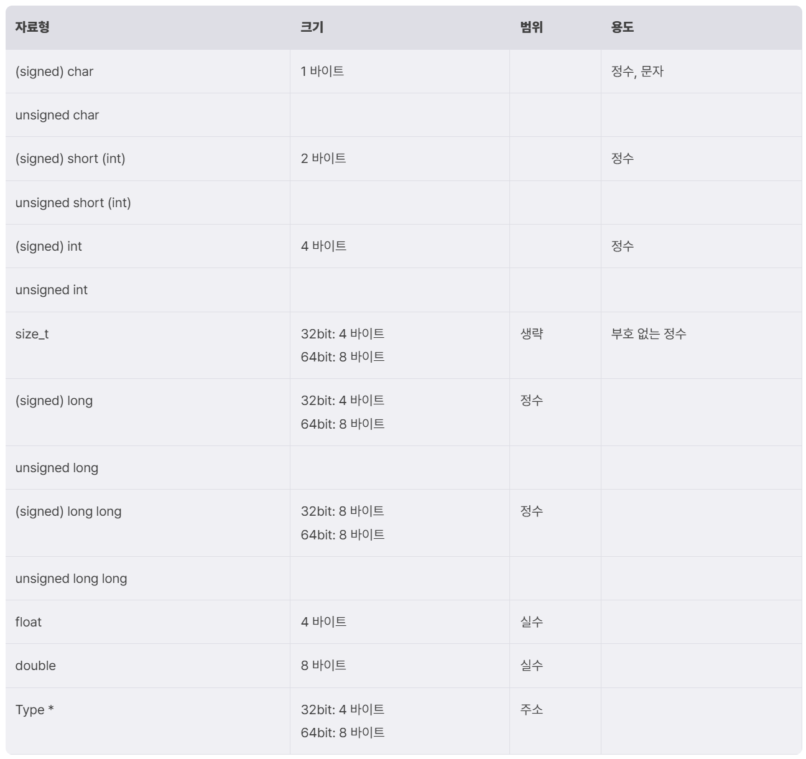

# Type Error - C Language

# Logical Bug: Type Error

## 들어가며

---

자료형은 변수의 크기를 정의하고, 용도를 암시한다. 예를 들어, int 형으로 변수를 선언하면, 그 변수는 4바이트의 크기를 갖고 정수 연산에 사용될 변수임을 의미한다.

자료형이 담고 있는 정보는 컴파일러에도 전달된다. 컴파일러는 변수의 자료형을 참고하여 변수에 관한 코드를 생성한다. int 형 변수에는 4바이트 공간이 할당되고, char 형 변수에는 1바이트 공간이 할당된다. 그리고 각 변수에 대한 연산은 그 메모리 공간을 대상으로 이루어진다.

한 번 정의된 변수의 자료형은 바꿀 수 없다. 달리 말하면, 변수에 할당된 메모리의 크기는 확장되거나 줄어들지 않는다. 이에 따라 1바이트 크기의 변수에 1을 더하다가 그 값이 0xff를 넘어서게 되면, 0x100이 되는 것이 아니라 0x00이 된다. 이런 현상을 데이터가 넘쳐서 유실되었다고 하며 **overflow**라고 부른다.

마찬가지로, 변수의 크기보다 큰 값을 대입하려 할 때도 데이터가 유실될 수 있다. 예를 들어 4바이트 크기의 변수에 0x123456789abcdef을 대입하려 하면, 하위 4바이트인 0x89abcdef만 저장되고 나머지 값은 모두 버려진다.

이번 강의에서는 개발자의 실수로 발생할 수 있는 위와 같은 **Type Error**들을 소개하고, 예제를 통해 살펴본다.

# 타입 에러

## 자료형

---

C 언어에는 여러 자료형이 있다. 각각의 자료형은 저장할 수 있는 데이터의 크기가 다르며, 일반적으로 저장하는 값의 용도가 정해져 있다. 아래는 C 언어 자료형의 크기와 용도에 대한 표이다.



주목해볼 만한 것은, 같은 자료형이라도 운영체제에 따라 크기가 달라질 수 있다는 점이다. 예를 들어, long은 32비트 운영체제에서는 4바이트의 크기를 갖지만, 64비트 운영 체제에서는 8바이트의 크기를 갖는다.

변수의 자료형을 선언할 때는 변수를 활용하는 동안 담게 될 값의 크기, 용도, 부호 여부를 고려해야 한다. **Type Error**는 이러한 고려 없이 부적절한 자료형을 사용했을 때 발생한다.

### Type.c

```c
//Name: type.c
//Compile: gcc -o type type.c

#include <stdio.h>

T factorial(unsigned int n) {
  T res = 1;

  for (int i = 1; i <= n; i++) {
    res *= i;
  }

  return res;
}

int main() {
  unsigned int n;

  printf("Input integer n: ");
  scanf("%d", &n);

  if (n >= 50) {
    fprintf(stderr, "Input is too large");
    return -1;
  }

  printf("Factorial of N: %llu\n", factorial(n));
}
```

factorial의 경우 항상 양수인 정수이며, 값이 쉽게 커지기 때문에 위 코드에서 자료형 T로 가장 적절한 것은 unsigned long long이다.

## Out of Range: 데이터 유실

---

**Out_of_range**는 앞의 예제를 변형한 것으로, int res에 unsigned long long factorial의 값을 반환한다.

### Out_of_Range

```c
// Name: out_of_range.c
// Compile: gcc -o out_of_range out_of_range.c

#include <stdio.h>

unsigned long long factorial(unsigned int n) {
  unsigned long long res = 1;

  for (int i = 1; i <= n; i++) {
    res *= i;
  }

  return res;
}

int main() {
  unsigned int n;
  unsigned int res;

  printf("Input integer n: ");
  scanf("%d", &n);

  if (n >= 50) {
    fprintf(stderr, "Input is too large");
    return -1;
  }

  res = factorial(n);
  printf("Factorial of N: %u\n", res);
}
```

코드를 실행하고 값을 입력하다 보면 18에서 갑자기 값이 작아지는 것을 확인할 수 있다.

```c
$ ./out_of_range
Input integer n: 17
Factorial of N: 4006445056
$ ./out_of_range
Input integer n: 18
Factorial of N: 3396534272
```

양수를 곱하기만 했는데, 값이 작아지는 이유는 res에 저장될 수 있는 범위보다 훨씬 큰 값을 저장하려 했기 때문이다.

이처럼, 변수에 어떤 값을 대입할 때, 그 값이 변수에 저장될 수 있는 범위를 벗어나면, 저장할 수 있는 만큼만 저장하고 나머지는 유실된다

## Out of Range: 부호 반전과 값의 왜곡

---

**oor_signflip**은 앞의 예제에서 main 함수의 변수 n의 자료형이 int로 바뀌었다. 이는 값으로 음수를 입력하면 23번 라인의 검사를 우회할 수 있음을 의미한다.

### oor_signflip

```c
// Name: oor_signflip.c
// Compile: gcc -o oor_signflip oor_signflip.c

#include <stdio.h>

unsigned long long factorial(unsigned int n) {
  unsigned long long res = 1;

  for (int i = 1; i <= n; i++) {
    res *= i;
  }

  return res;
}

int main() {
  int n;
  unsigned int res;

  printf("Input integer n: ");
  scanf("%d", &n);

  if (n >= 50) {
    fprintf(stderr, "Input is too large");
    return -1;
  }

  res = factorial(n);
  printf("Factorial of N: %u\n", res);
}
```

코드를 실행하고, -1을 입력하면 한참의 시간이 걸려도 결과가 나오지 않는다.

```c
$ ./oor_signflip
Input integer n: -1

```

int n에 -1을 저장하면, n의 메모리 공간에 저장되는 값은 0xffffffff이다.

그런데 factorial 함수는 unsigned int n을 인자로 받으므로, 이 값은 부호 없는 정수인 4294967295로 전달되고, 결국 4294967295번 반복문을 실행하게 된다. 당연히, 시간이 오래 걸릴 뿐만 아니라 값이 너무 커져서 연산도 제대로 이루어지지 않는다.

이런 문제를 예방하려면 양수로만 쓰일 값에는 반드시 unsigned를 붙이는 습관을 들여야한다.

## Out of Range와 버퍼 오버플로우

---

**oor_bof**는 잘못된 자료형의 사용이 스택 버퍼 오버플로우로 이어지는 코드이다. 코드를 살펴보면, 버퍼 오버플로우를 막기 위해 size가 32보다 작은지 검사한다. 그러나 size가 int 형이므로 음수를 전달하여 검사를 우회할 수 있다.

### oor_bof

```c
// Name: oor_bof.c
// Compile: gcc -o oor_bof oor_bof.c -m32

#include <stdio.h>

#define BUF_SIZE 32

int main() {
  char buf[BUF_SIZE];
  int size;
  
  printf("Input length: ");
  scanf("%d", &size);
  
  if (size > BUF_SIZE) {
    fprintf(stderr, "Buffer Overflow Detected");
    return -1;
  }
  
  read(0, buf, size);
  return 0;
}
```

이때, read 함수의 세 번째 인자는 부호가 없는 size_t 형이므로, 음수를 전달하면 매우 큰 수로 해석된다.

```c
ssize_t read(int fd, void *buf, size_t count);
```

실제로 size에 -1을 입력하고 32바이트보다 큰 데이터를 입력하면 다음과 같이 스택 버퍼 오버플로우가 발생한다.

```c
$ ./oor_bof
Input length: -1
AAAAAAAAAAAAAAAAAAAAAAAAAAAAAAAAAAAAAAAAAAAAAAAAAAAA
*** stack smashing detected ***: <unknown> terminated
Aborted (core dumped)
```

**64비트로 컴파일 했을 때는 안 되는 이유**

64비트 환경에서 -1은 0xffffffffffffffff이다. size_t는 64비트 환경에서 8바이트 크기의 부호 없는 정수를 나타내므로, size_t로 변환하면 -1은 18446744073709551615이 된다. 이때 read를 호출이 커널로 들어가면, 커널은 유저가 준 버퍼 주소에 데이터를 쓰기 전에 buf 주소부터 count 바이트만큼의 영역이 유저 공간 메모리 범위 안에 있는지 확인한다. 근데 리눅스에서 유저 공간 주소 범위는 대략 0x0~0x00007FFFFFFFFFFF이다. 따라서 유저 공간을 넘어가므로 EFAULT 에러를 반환하고 아무것도 읽지 않는다.

## 타입 오버플로우와 언더플로우

---

변수의 값이 연산 중에 자료형의 범위를 벗어나면, 갑자기 크기가 작아지거나 커지는 현상이 발생하는데, 이런 현상을 Type Overflow/Underflow라고 부른다. 정수 자료형을 대상으로 발생하면 Type에 Integer를 넣어 **Integer Overflow/Underflow**라고 한다.

### 정수 오버플로우와 언더플로우 예제 코드

```c
// Name: integer_example.c
// Compile: gcc -o integer_example integer_example.c

#include <limits.h>
#include <stdio.h>

int main() {
  unsigned int a = UINT_MAX + 1;
  int b = INT_MAX + 1;

  unsigned int c = 0 - 1;
  int d = INT_MIN - 1;

  printf("%u\n", a);
  printf("%d\n", b);

  printf("%u\n", c);
  printf("%d\n", d);
  return 0;
}
```

예제를 실행해보면, 오버플로우가 발생했을 때는 자료형이 표현할 수 있는 최소값이 되며, 언더 플로우가 발생하면 최댓값이 되는 것을 알 수 있다.

```c
$ ./integer_example
0
-2147483648
4294967295
2147483647
```

## Integer Overflow와 버퍼 오버플로우

---

다음은 integer overflow가 힙 버퍼 오버플로우로 이어지는 예제 코드이다. 예제는 사용자로부터 size 값을 입력받고, size+1크기의 버퍼를 할당한다. 그리고 그 버퍼에 size 만큼 사용자 입력을 받는다.

### Integer Overflow

```c
// Name: integer_overflow.c
// Compile: gcc -o integer_overflow integer_overflow.c -m32

#include <stdio.h>
#include <unistd.h>
#include <stdlib.h>

int main() {
  unsigned int size;
  scanf("%u", &size);
  
  char *buf = (char *)malloc(size + 1);
  unsigned int read_size = read(0, buf, size);
  
  buf[read_size] = 0;
  return 0;
}
```

만약 사용자가 size에 unsigned int의 최대값인 4294967295을 입력하면, integer overflow로 인해 size + 1은 0이 된다. 이 값이 malloc에 전달되면, malloc은 최소 할당 크기인 32바이트만큼 청크를 할당해준다. 반면 read 함수는 size 값을 그대로 사용한다. 따라서 32바이트 크기의 청크에 4294967295만큼 값을 쓸 수 있는, 힙 버퍼 오버플로우가 발생하게 된다.

힙 버퍼 오버플로우는 돌아갈 리턴 주소를 덮는 등의 문제가 없지만, 다른 공격 대상들이 존재한다.

# 실습

## Exploit Tech

---

[Exploit Tech: Type Error](Exploit%20Tech%20Type%20Error%20364a9179d3af80b4b8c1faed770f772a.md)