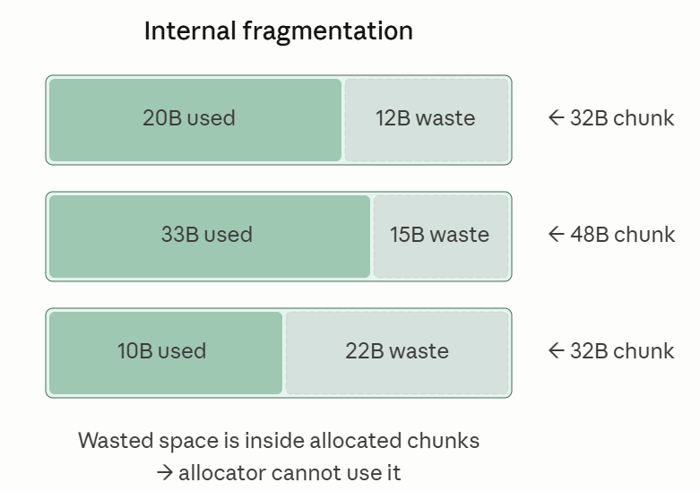

# Use-After-Free (UAF)

# Background: ptmalloc2

## 들어가며

---

운영체제의 핵심 역할 중 하나는 한정된 메모리 자원을 각 프로세스에 효율적으로 배분하는 것이다. 운영체제의 **Memory Allocator**는 이 동작이 빠르고, 메모리의 낭비 없이 이뤄지도록 특수한 알고리즘으로 구현된다.

Memory Allocator 알고리즘의 종류

- ptmalloc2 : 리눅스
- tcmalloc : 구글
- jemalloc : 페이스북, 파이어폭스

ptmalloc2는 어떤 메모리가 해제되면, 해제된 메모리의 특징을 기억하고 있다가 비슷한 메모리의 할당 요청이 발생하면 이를 빠르게 반환한다.

ptmalloc2는 동적 메모리를 관리하는 리눅스의 핵심 알고리즘이며, 이와 관련하여 과거부터 다양한 공격 기법이 연구되었다. 이러한 새로운 공격 기법들에 따라 새로운 보호 기법들이 나타났다. 따라서 ptmalloc2는 구현된 GLibc의 버전에 따라서 적용할 수 있는 공격 기법에 차이가 있다.

따라서 이번 강의에서는 가상환경에서 진행한다.

## 실습 환경 Dockerfile

---

```c
FROM ubuntu:18.04

ENV PATH="${PATH}:/usr/local/lib/python3.6/dist-packages/bin"
ENV LC_CTYPE=C.UTF-8

RUN apt update
RUN apt install -y \
    gcc \
    git \
    python3 \
    python3-pip \
    ruby \
    sudo \
    tmux \
    vim \
    wget

# install pwndbg
WORKDIR /root
RUN git clone https://github.com/pwndbg/pwndbg
WORKDIR /root/pwndbg
RUN git checkout 2023.03.19
RUN ./setup.sh

# install pwntools
RUN pip3 install --upgrade pip
RUN pip3 install pwntools

# install one_gadget command
RUN gem install one_gadget

WORKDIR /root
```

```c
$ IMAGE_NAME=ubuntu1804 CONTAINER_NAME=my_container; \
docker build . -t $IMAGE_NAME; \
docker run -d -t --privileged --name=$CONTAINER_NAME $IMAGE_NAME; \
docker exec -it -u root $CONTAINER_NAME bash
```

## ptmalloc2의 핵심 원리

---

**ptmalloc2(pt**read **malloc2)**는 Wolfram Gloger가 개발한 Memory Allocator로, Doug Lea의 **dlmalloc**을 개선한 ptmalloc의 두 번째 버전이다. ptmalloc2는 리눅스에서 사용되며, GLibc에 구현되어 있다.

ptmalloc2의 구현 목표는 메모리의 효율적인 관리이다. 메모리의 효율적인 관리의 핵심은 다음과 같다.

1. 메모리 낭비 방지
2. 빠른 메모리 재사용
3. 메모리 단편화 방지

ptmalloc의 메모리 관리 전략을 살펴보자.

### 메모리 낭비 방지

컴퓨터 전체 메모리는 한정적이므로 계속해서 새로운 메모리 공간을 할당해줄 수는 없다. 그래서 ptmalloc2는 메모리 할당 요청이 발생하면, 먼저 해제된 메모리 공간 중에서 재사용할 수 있는 공간이 있는지 탐색한다.

OS는 프로그램이 실행될 때 text, data, bss, 스택 영역을 할당해준다. 이후 유저가 메모리 영역을 동적으로 사용하기 위해 malloc을 하게 되면 이때 heap 영역이 할당된다. 이때 top chunk 안에서 잘라서 주는 것은 비용이 크지 않다. 하지만 top chunk가 부족해서 힙을 확장해야 하면 brk 시스템 콜로 heap 경계를 늘려야 하므로 비용이 많이 필요하게 된다.

따라서 새로운 영역을 계속해서 할당해주는 것은 비용이 많이 들기 때문에 이미 해제된 메모리 영역을 할당해 줄 수 있다면 이미 해제된 메모리 영역을 할당해준다. 이때 요청한 크기와 동일한 영역이 있다면 그 영역을 할당하고, 만약 똑같은 영역은 존재하지 않지만 더 큰 영역이 존재한다면 큰 영역을 나눠서 할당해준다.

### 빠른 메모리 재사용

운영체제가 프로세스에게 제공해주는 가상 메모리 공간은 매우 넓다. 따라서 특정 메모리 공간을 해제한 후 이를 빠르게 재사용하려면 해제된 메모리 공간의 주소를 기억하고 있어야한다. 이를 위해서 ptmalloc2는 메모리 공간을 해제할 때, tcache 또는 bin이라는 연결 리스트에 해제된 공간의 정보를 저장해둔다.

tcache와 bin은 여러 개가 정의되어 있으며, 각각은 서로 다른 크기의 메모리 공간들을 저장한다. 이렇게 하면 특정 크기의 할당 요청이 발생했을 때, 그 크기와 관련된 저장소를 우선적으로 탐색하면 되므로 더욱 효율적으로 공간을 재사용할 수 있다.

### 메모리 단편화 방지

**메모리 단편화(Memory Fragmentation)**는 메모리 관리 이론에서 다루는 중요한 문제이다.

- **내부 단편화(Internal Fragmentation) :** 할당한 메모리 공간의 크기에 비해 실제 데이터가 점유하는 공간이 작을 때 발생하는 비효율
- **외부 단편화(External Fragmentation) :** 할당한 메모리 공간들 사이에 공간이 많아서 발생하는 비효율




메모리 단편화가 발생하면 전체 메모리 공간이 여러 데이터들에 의해 부분적으로 점유되므로 공간 낭비가 심해지고, 메모리 사용의 효율이 감소한다.

ptmalloc2는 단편화를 줄이기 위해 **정렬(Alignment)**과 **병합(Coalescence)** 그리고 **분할(Split)**을 사용한다. 64비트 환경에서 ptmalloc2는 메모리 공간을 16바이트 단위로 할당해준다. 즉, 만약 사용자가 4바이트 크기의 공간을 요청하면 16바이트를, 17바이트 크기의 공간을 요청하면 32바이트 크기의 공간을 할당해준다. 이렇게 공간을 할당하면 내부 단편화는 발생할 수 있지만, 외부 단편화를 감소시킨다.

만약 메모리 공간을 사용한 순서대로 공간이 해제된다면, 계속해서 병합되므로 굳이 분할을 해서 할당을 해줄 필요가 없다. 하지만 현실에서는 공간을 해제하는 순서가 꼭 할당된 순서가 아니기 때문에 공간을 16바이트 크기로 정렬해서 중간 중간 빈 부분이 있더라도 더욱 효율적으로 사용할 수 있게 한다. 예를 들어, 만약 위의 외부 단편화 그림처럼 30B 공간이 존재하는데 31바이트 크기의 공간 할당을 요청한다면 30바이트 공간은 할당해줄 수 없다. 따라서 31바이트 크기의 공간을 새롭게 사용해야 한다. 하지만 만약 16바이트 단위로 정렬했었다면 애초에 30바이트 공간을 위해서 32바이트를 할당해주었을 것이고, 그 공간을 해제하면 32바이트 크기 공간이 빈 공간으로 남기 때문에 31바이트도 32바이트 공간으로 사용할 수 있었다. 즉, 일반화된 공간을 제공하여 공간 재사용 가능성을 늘릴 수 있다.

## ptmalloc2의 객체

---

ptmalloc2는 청크(Chunk), bin, tcache, arena를 주요 객체로 사용한다.

### 청크 (Chunk)

청크(Chunk)는 덩어리라는 뜻으로, ptmalloc2가 할당한 메모리 공간을 의미한다. 청크는 헤더와 데이터로 구성된다.

- 헤더 : 청크 관리에 필요한 정보를 담고 있다.
- 데이터 : 사용자가 입력한 데이터가 저장된다.

헤더는 청크의 상태를 나타내고, 사용 중인 청크(in-use)의 헤더와 해제된 청크(freed)의 헤더가 서로 구조가 다르다. 해제된 청크는 fd와 bk를 사용한다.


청크 헤더의 각 요소는 다음과 같다.

| 이름 | 크기 | 의미 |
| --- | --- | --- |
| prev_size | 8바이트 | 인접한 직전 청크의 크기. 청크를 병합할 때 직전 청크를 찾는데 사용된다. |
| size | 8바이트 | 현재 청크의 크기. 헤더의 크기도 포함한 값이다. 64비트 환경에서, 사용 중인 청크 헤더의 크기는 16바이트이므로 사용자가 요청한 크기를 정렬하고, 그 값에 16바이트를 더한 값이 된다. |
| flags | 3비트 | 64비트 환경에서 청크는 16바이트 단위로 할당되므로, size의 하위 4비트는 의미를 갖지 않는다. 그래서 ptmalloc은 size의 하위 3비트를 청크 관리에 필요한 플래그 값으로 사용한다.

각 플래그는 순서대로 allocated arena(A), mmap’d(M), prev-in-use(P)를 나타낸다. prev-in-use 플래그는 직전 청크가 사용중인지를 나타내므로, ptmalloc2는 이 플래그를 참조하여 병합이 필요한지 판단할 수 있다. 나머지 플래그는 따로 설명하지 않는다. |
| fd | 8바이트 | 연결 리스트에서 다음 청크를 가리킨다. **해제된 청크에만 있다.** |
| bk | 8바이트 | 연결 리스트에서 이전 청크를 가리킨다. **해제된 청크에만 있다.** |

### bin

bin은 사용이 끝난 청크들이 저장되는 객체이다. 메모리의 낭비를 막고, 해제된 청크를 빠르게 재사용할 수 있게 한다.

ptmalloc2에는 총 128개의 bin이 정의되어 있다. 이중 62개는 smallbin, 63개는 largebin, 1개는 unsortedbin으로 사용되고, 나머지 2개는 사용되지 않는다.


### smallbin

smallbin에는 32바이트 이상 1024바이트 미만의 크기를 갖는 청크들이 보관된다. 하나의 smallbin에는 같은 크기를 갖는 청크들이 보관되고, index가 1 증가할 때마다 청크의 크기가 16바이트씩 커진다. 즉 smallbin[0]은 32바이트 크기, smallbin[61]은 1008바이트의 크기를 갖는다.

smallbin은 원형 이중 연결 리스트(circular doubly-linked list)이며, 먼저 해제된 청크가 먼저 재할당되는 FIFO(First-In-First-Out, 선입선출) 방식을 따른다.

smallbin에서 청크를 추가하거나 제거할 때 연결 고리를 끊는 과정이 필요한데, 이를 unlink라고 한다. smallbin의 청크들은 ptmalloc2의 병합 대상이다. 메모리상에서 인접한 두 청크가 해제되어 있고, 이들이 smallbin에 들어있으면 이 둘은 병합된다. ptmalloc2는 이 과정을 consolidation(병합)이라고 부른다.

**원형 이중 연결 리스트인 이유**
청크의 병합을 위해서 중간에 있는 노드를 빼서 사용할 수 있어야한다. A → B → C → D 를 할당했다가 B, C를 해제한다면 중간에 있는 B, C노드 두개를 병합해서 다른 bin의 위치로 옮겨야 한다. 따라서 중간에 있는 노드를 접근하기 위해서 이중 연결 리스트를 사용한다. 원형인 이유는 앞 뒤에 빠르게 접근하기 위해서 이다.

**FIFO 방식을 따르는 이유**
LIFO 방식을 따르면 속도가 더 빨라지기는 하지만 메모리 공간을 뒤쪽에서만 재사용하게 되므로 앞쪽 공간을 낭비할 확률이 높아진다. 따라서 FIFO 방식으로 속도보다는 공간의 효율성을 늘린다.

참고로 bins에는 sentinel 노드가 들어있어서 단순한 head가 아니라 데이터가 없는 하나의 노드가 존재한다.
| fd | data(NULL) | bk |

### fastbin

일반적으로 크기가 큰 청크보다는 작은 청크들이 더욱 빈번하게 할당되고 해제된다. 따라서 작은 청크들의 경우 메모리 효율성보다는 속도가 더욱 중요해진다.

fastbin에는 32바이트 이상 176바이트 이하 크기의 청크들이 보관되며, 이에 따라 16바이트 단위로 총 10개의 fastbin이 있다. 리눅스는 이 중에서 작은 크기부터 7개의 fastbin만을 사용한다. 즉, 리눅스에서는 32바이트 이상, 128바이트 이하의 청크들을 fastbin에 저장한다.

fastbin은 단일 연결 리스트이다. 또한 fastbin은 LIFO 방식을 따른다.

**단일 연결 리스트인 이유**
fastbin의 경우 메모리 단편화보다 속도를 중요시하여 구현하였기 때문에, 청크 병합을 하지 않는다. 따라서 청크 병합을 할 필요가 없기 때문에, 중간에 있는 노드를 꺼내서 사용하지 않아도 된다.

**LIFO 방식을 따르는 이유**
속도를 중시하기 때문에 FIFO 방식보다 속도가 빠른 LIFO 방식을 사용한다. 

참고로 fastbin의 경우 smallbin 영역 일부가 fastbin으로 취급되는줄 알았는데 그게 아니라 아예 fastbinY라는 다른 bin으로 애초에 따로 관리된다. bins의 경우 sentinel 노드가 저장되어 있지만 fastbin은 단순히 head만 저장되어 있는 방식이기 때문에 구조가 다르기도 하고, fastbin에 있는 노드들이 smallbin으로 다시 옮겨져서 병합이 될 수도 있다.

### largebin

largebin은 1024바이트 이상의 크기를 갖는 청크들이 보관된다. 총 63개의 largebin이 있는데, largebin의 경우 index가 증가하면 크기가 로그적으로 증가한다. 이때 마지막 largebin의 경우 상한이 없다.

largebin은 smallbin처럼 정해진 크기의 청크를 저장하는 것이 아닌, 범위 내의 모든 청크들을 저장하기 때문에, 같은 largebin내의 청크를 내림차순으로 정렬하여 요청이 오면 크기가 가장 비슷한 청크를 빠르게 재할당해준다.

largebin도 원형 이중 연결 리스트로 병합이 대상이 된다.

### unsortedbin

사실 청크가 해제되면 바로 smallbin, largebin으로 들어가는 것이 아닌 fastbin또는 unsortedbin에 먼저 저장된다. 이는 같은 크기의 요청을 바로 할 가능성이 높기 때문에 정렬을 먼저 하기 전에 같은 요청이 오면 바로 할당해주기 위해서이다.

unsortedbin은 원형 이중 연결 리스트로 구현되어 있지만, 병합을 하거나 내부적으로 정렬을 하지는 않는다. bins에 있기 때문에 구조를 맞추기 위해서 원형 이중 연결 리스트로 구현되어 있는 것이다.

smallbin 크기에 해당하는 청크를 할당 요청하면, ptmalloc2는 fastbin또는 smallbin을 탐색한 뒤 unsortedbin을 탐색한다.
largebin 크기에 해당하는 청크를 할당 요청하면, unsortedbin을 먼저 탐색하고 largebin을 탐색한다.

unsortedbin을 탐색할 때 맞지 않는 크기의 chunk라면 이때 smallbin이나 largebin으로 이동한다.

### arena

arena는 fastbin, smallbin, largebin 등의 정보를 모두 담고 있는 객체이다. 멀티 쓰레드 환경에서 ptmalloc2는 레이스 컨디션을 막기 위해서 arena에 접근할 때 arena에 락을 적용한다. 이 방식을 사용하면 레이스 컨디션은 막을 수 있지만, 반대로 병목 현상을 일으킬 수 있다.

ptmalloc2는 이를 최대한 막기 위해서 최대 64개(최대 CPU 코어 개수와 운영체제에 따라 상이, x86-64 코어 8 기준)의 arena를 생성할 수 있다. arena에 락이 걸려서 대기해야하는 경우, 새로운 arena를 생성해서 이를 피할 수 있다. 그런데, 생성할 수 있는 개수에 제한이 있으므로 과도한 멀티 쓰레드 환경에서는 결국 병목 현상이 발생한다. 그래서 glibc 2.26에서는 tcache를 추가적으로 도입했다.

레이스 컨디션이란 어떤 공유 자원을 여러 쓰레드나 프로세스에서 접근할 때 발생하는 오작동을 의미한다. 예를 들어, 한 쓰레드가 어떤 사용자의 계정 정보를 참조하고 있는데, 다른 쓰레드가 그 계정 정보를 삭제하면, 참조하고 있던 쓰레드에서는 삭제된 계정 정보를 참조하게 된다.

이런 문제를 해결하기 위해서 멀티 쓰레딩을 지원하는 프로그래밍 언어들은 락(Lock) 기능을 제공한다. 한 쓰레드에서 arena[0]에 락을 걸면 그 쓰레드의 사용이 끝날 때까지 arena[0]에는 다른 쓰레드가 접근할 수 없다. 따라서 사실 arena에서는 락으로 인해 쓰레드를 무제한 대기시키는 데드락은 발생하지 않는다.

**헷갈린 부분**

arena가 멀티 쓰레드 환경에서 어떻게 레이스 컨디션을 막는가? arena[0]에서 락을 걸어도 arena[1]에서 접근해버리면 문제가 생기지 않나?
→ arena 자체마다 bins가 각각 존재한다. 따라서 arena[0]의 smallbin[0]과 arena[1]의 smallbin[0]은 아예 다른 객체이다. 따라서 접근해도 상관이 없다.

### tcache

tcache는 thread local cache의 약자로 각 쓰레드에 독립적으로 할당되는 캐시 저장소를 지칭한다. tcache는 glibc 버전 2.26에서 도입되었으며, 멀티 쓰레드 환경에 더욱 최적화된 메모리 관리 메커니즘을 제공한다.

각 쓰레드는 64개의 tcache를 가지고 있다. tcache의 경우 fastbin과 마찬가지로 LIFO 방식으로 사용되는 단일 연결 리스트이며, 하나의 tcache는 같은 크기의 청크들만 보관한다. 리눅스는 각 tcache에 보관할 수 있는 청크의 개수를 7개로 제한하고 있는데, 이는 쓰레드마다 정의되는 tcache의 특성상, 무제한으로 청크를 연결할 수 있으면 메모리가 낭비되기 때문이다. tcache에 들어간 청크들은 병합되지 않는다.

tcache에는 32바이트 이상, 1040바이트 이하의 크기를 갖는 청크들이 보관된다. (1040 - 32) / 16 = 63 → 64개. tcache가 가득찼을 경우 적절한 bin으로 분류된다.

tcache는 각 쓰레드가 고유하게 갖는 캐시이기 때문에, ptmalloc2는 레이스 컨디션을 고려하지 않고 이 캐시에 접근할 수 있다. arena의 bin에 접근하기 전에 tcache를 먼저 사용하므로 arena에서 발생할 수 있는 병목 현상을 완화하는 효과가 있다.

tcache는 보안 검사가 많이 생략되어 있어 공격자들에게 힙 익스플로잇의 공격 벡터가 될 수 있다.

# Memory Corruption: Use After Free

## 들어가며

---

Use-After-Free는 메모리 참조에 사용한 포인터를 메모리 해제 후에 적절히 초기화하지 않아서, 또는 해제한 메모리를 초기화하지 않고 다음 청크에 재할당해주면서 발생하는 취약점이다. 이 취약점은 현재까지도 브라우저 및 커널에서 자주 발견되고 있으며, 익스플로잇 성공률도 다른 취약점에 비해 높아 상당히 위험하다.

## 실습 환경 Dockerfile

---

위에서 세팅한 환경에서 진행하면 된다.

## Dangling Pointer

---

**Dangling Pointer**는 유효하지 않은 메모리 영역을 가리키는 포인터를 말한다. 메모리 동적 할당에 사용되는 malloc 함수는 할당한 메모리의 주소를 반환한다. 일반적으로, 메모리를 동적 할당할 때는 포인터를 선언하고, 그 포인터에 malloc 함수가 할당한 메모리의 주소를 저장한다. 그리고 그 포인터를 참조하여 할당한 메모리에 접근한다.

메모리를 해제할 때는 free 함수를 호출한다. 그런데 free 함수는 청크를 ptmalloc에 반환하기만 할 뿐, 청크의 주소를 담고 있던 포인터를 초기화하지 않는다. 따라서 free의 호출 이후에 프로그래머가 포인터를 초기화하지 않으면, 포인터는 해제된 청크가 가리키는 Dangling Pointer가 된다.

Dangling Pointer가 생긴다고 해서 프로그램이 보안적으로 취약한 것은 아니다. 하지만 프로그램이 예상치 못한 동작을 할 가능성을 키우며, 경우에 따라서 공격자에게 공격 수단으로 활용될 수 있다.

### Dangling_ptr.c

```c
// Name: dangling_ptr.c
// Compile: gcc -o dangling_ptr dangling_ptr.c
#include <stdio.h>
#include <stdlib.h>

int main() {
  char *ptr = NULL;
  int idx;

  while (1) {
    printf("> ");
    scanf("%d", &idx);
    switch (idx) {
      case 1:
        if (ptr) {
          printf("Already allocated\n");
          break;
        }
        ptr = malloc(256);
        break;
      case 2:
        if (!ptr) {
          printf("Empty\n");
        }
        free(ptr);
        break;
      default:
        break;
    }
  }
}
```

예제에서는 청크를 해제한 후 청크를 가리키던 ptr 변수를 초기화하지 않는다. 따라서 다음과 같이 청크를 할당하고 해제하면, ptr은 이전에 할당한 청크의 주소를 가리키는 Dangling Pointer가 된다.

```c
$ gcc -o dangling_ptr dangling_ptr.c -no-pie
$ ./dangling_ptr
> 1
> 2
```

ptr이 해제된 청크의 주소를 가리키고 있으므로, 이를 다시 해제할 수 있다.

```c
$ ./dangling_ptr
> 1
> 2
> 2
free(): double free detected in tcache 2
Aborted (core dumped)
```

이를 **Double Free Bug** 라고 하는데, 프로그램에 심각한 위협이 되는 소프트웨어 취약점이다.

## Use After Free

---

위에서 본 것처럼 Dangling Pointer로 인해서 UAF 문제가 발생하기도 하지만, 새롭게 할당한 영역을 초기화하지 않고 사용하여도 문제가 발생할 수 있다.

malloc과 free 함수는 데이터들을 초기화하지 않으므로, 메모리에 있던 데이터들이 유출될 수 있다.

### uaf.c

```c
// Name: uaf.c
// Compile: gcc -o uaf uaf.c -no-pie
#include <stdio.h>
#include <stdlib.h>
#include <string.h>

struct NameTag {
  char team_name[16];
  char name[32];
  void (*func)();
};

struct Secret {
  char secret_name[16];
  char secret_info[32];
  long code;
};

int main() {
  int idx;

  struct NameTag *nametag;
  struct Secret *secret;

  secret = malloc(sizeof(struct Secret));

  strcpy(secret->secret_name, "ADMIN PASSWORD");
  strcpy(secret->secret_info, "P@ssw0rd!@#");
  secret->code = 0x1337;

  free(secret);
  secret = NULL;

  nametag = malloc(sizeof(struct NameTag));

  strcpy(nametag->team_name, "security team");
  memcpy(nametag->name, "S", 1);

  printf("Team Name: %s\n", nametag->team_name);
  printf("Name: %s\n", nametag->name);

  if (nametag->func) {
    printf("Nametag function: %p\n", nametag->func);
    nametag->func();
  }
}
```

```c
$ gcc -o uaf uaf.c -no-pie
$ ./uaf
Team Name: security team
Name: S@ssw0rd!@#
Nametag function: 0x1337
Segmentation fault (core dumped)
```

출력 결과를 보면 다음과 같이 Secret 구조체 내부에 저장했던 내용들이 유출되었다. 이유를 알아보자.

### uaf 동적 분석

먼저 구조체의 크기를 보면 NameTag와 Secret 구조체의 크기가 동일하다. 따라서 malloc으로 처음에 secret을 할당하고 해제한 후, nametag를 malloc으로 할당하게 될 경우 원래 secret이 점유하던 공간을 nametag가 할당받을 것이다. 이때 free와 malloc은 초기화를 진행하지 않으므로 nametag에 secret의 내용이 일부 남아 있게 된다.

gdb를 이용해 secret을 free하는 부분에서 중단점을 설정해보자.

```c
$ gdb uaf
pwndbg> disass main
Dump of assembler code for function main:
...
   0x0000000000400647 <+96>:    mov    rax,QWORD PTR [rbp-0x10]
   0x000000000040064b <+100>:   mov    rdi,rax
   0x000000000040064e <+103>:   call   0x4004c0 <free@plt>
   0x0000000000400653 <+108>:   mov    QWORD PTR [rbp-0x10],0x0
...
End of assembler dump.
pwndbg> b *main+108
Breakpoint 1 at 0x400653
pwndbg> r
Starting program: /home/dreamhack/uaf

Breakpoint 1, 0x0000000000400653 in main ()
...
───────────────────────────────────[ DISASM ]───────────────────────────────────
 ► 0x400653 <main+108>    mov    qword ptr [rbp - 0x10], 0
...
Breakpoint *main+108
```

heap 명령으로 heap 영역을 살펴보면 다음과 같다.

```c
pwndbg> heap
Allocated chunk | PREV_INUSE
Addr: 0x602000
Size: 0x251

Free chunk (tcachebins) | PREV_INUSE
Addr: 0x602250
Size: 0x41
fd: 0x00

Top chunk | PREV_INUSE
Addr: 0x602290
Size: 0x20d71
}
```

이때 우리가 살펴볼 영역은 Free chunk로 0x602250에 해당하는 부분이다. 0x602000은 tcache_perthread_struct로 malloc이 호출될 때 ptmalloc2가 자동으로 할당하는 tcache 관리 구조체이다. 각 스레드의 tcache bin 개수와 리스트 헤드 정보를 담고 있다. Top chunk는 기본으로 할당된 힙 영역이다.

0x602250의 크기를 보면 0x41인데 이때 size의 하위 3비트는 AMP이므로 실제로는 0x40이고, 확인해보면 0x602250 + 0x40 = 0x602290으로 Top Chunk와 딱 맞는 것을 알 수 있다.

0x602250 영역의 경우 secret에서 사용하던 영역이고, free로 해제는 하였지만 초기화는 되지 않았다. gdb로 확인해보자.

```c
pwndbg> x/10gx 0x602250
0x602250:	0x0000000000000000	0x0000000000000041
0x602260:	0x0000000000000000	0x0000000000602010
0x602270:	0x6472307773734050	0x0000000000234021
0x602280:	0x0000000000000000	0x0000000000000000
0x602290:	0x0000000000001337	0x0000000000020d71
pwndbg> x/s 0x602270
0x602270:	"P@ssw0rd!@#"
pwndbg>
```

실제로 확인해보면 0x602250~0x602260의 경우 청크 헤더 부분이었고, 0x602260~0x602270의 경우 fd, bk 값으로 초기화 되었으며, 이 이후의 값은 그대로 유지되어 있는 것을 알 수 있다.

nametag를 할당하고 printf 함수로 호출하는 시점에서 nametag 멤버 변수들의 값을 확인해보자.

```c
pwndbg> b *main+207
Breakpoint 2 at 0x4006b6
pwndbg> c
Continuing.

Breakpoint 2, 0x00000000004006b6 in main ()
...
───────────────────────────────────[ DISASM ]───────────────────────────────────
 ► 0x4006b6 <main+207>    call   printf@plt <0x4004d0>
        format: 0x4007a6 ◂— 'Team Name: %s\n'
        vararg: 0x602260 ◂— 'security team'

   0x4006bb <main+212>    mov    rax, qword ptr [rbp - 8]
   0x4006bf <main+216>    add    rax, 0x10
...
Breakpoint *main+207
pwndbg> x/10gx 0x602250
0x602250:   0x0000000000000000  0x0000000000000041
0x602260:   0x7974697275636573  0x0000006d61657420
0x602270:   0x6472307773734053  0x0000000000234021
0x602280:   0x0000000000000000  0x0000000000000000
0x602290:   0x0000000000001337  0x0000000000020d71
pwndbg> x/s 0x602260
0x602260:   "security team"
pwndbg> x/s 0x602270
0x602270:   "S@ssw0rd!@#"
pwndbg> x/gx 0x602290
0x602290:   0x0000000000001337
pwndbg>
```

nametag → team_name에는 “security team”으로 그대로 입력되었으나, nametag → name은 1바이트만 바꿨으므로 secret_info의 값이 남아있게된다. 또한 nametag → func 위치는 따로 초기화하지 않았으므로 secret → code에 있던 값이 그대로 남아있게 된다. 따라서 NULL이 아니므로 0x1337을 호출하게 되고, 따라서 segmentation Fault가 발생한다.

전체적으로 돌아가는 과정

- 작은 범위 : tcache → (fastbin) → smallbin → unsortedbin → largebin → top chunk → 새로 할당
- 큰 범위 : unsortedbin → largebin → top chunk → 새로 할당

# 실습

## Exploit Tech

---

[Exploit Tech: Use After Free](Exploit%20Tech%20Use%20After%20Free%20369a9179d3af800b8404f7876ea3475a.md)

# 스터디 하면서 새롭게 알게된 점

chunk는 prev_size라는 필드가 있는데, In-use 청크의 경우 물리적으로 뒤쪽에 있는 chunk의 prev_size를 덮어서 8바이트를 더 이용한다. prev_size의 경우 청크들을 병합할 때 사용되는 공간인데 In-use 청크의 경우 사용 중이기 때문에 병합할 수가 없어서 뒤쪽 청크의 prev_size가 필요하지 않다. 따라서 prev_size 청크를 덮어서 사용한다.