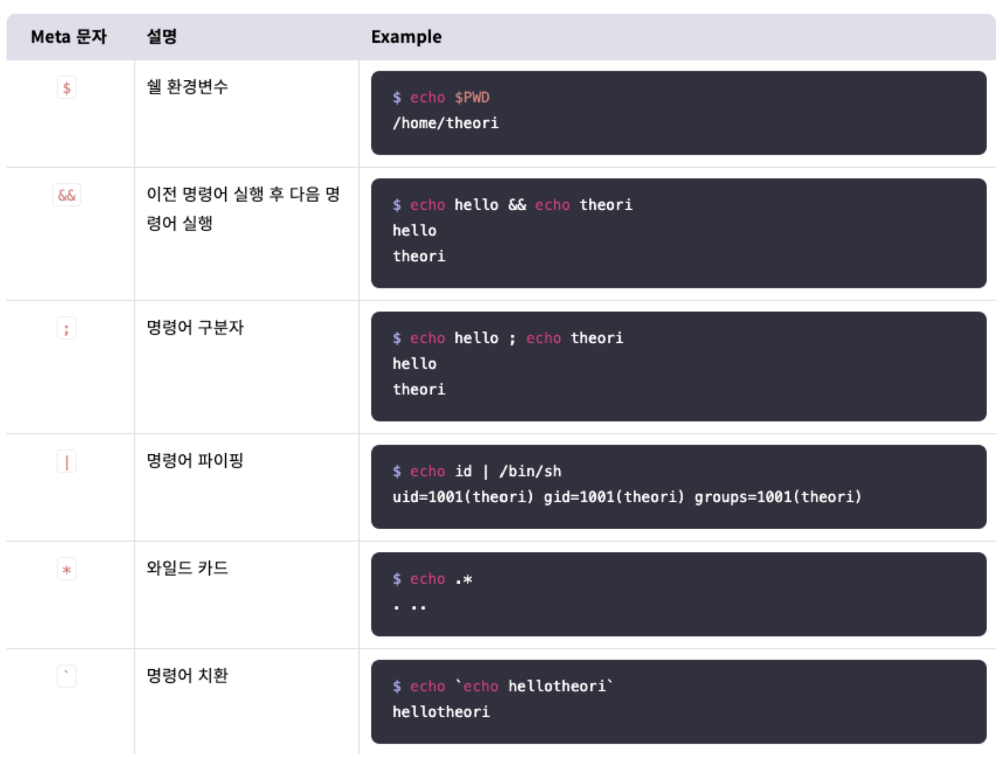

# Command Injection - C Language

# Logical Bug: Command Injection

## 들어가며

---

스스로 프로그램을 만들기 보다는 이미 있는 소프트웨어를 이용하는 것이 편리하다. 예를 들어 파일의 내용을 출력하는 프로그램을 만들기 보다는 cat 명령을 사용하는 것이 더 쉽다.

C/C++에서는 이럴 때 system 함수를 사용하게 된다. system 함수는 함수에 전달된 인자를 셸 프로그램에 전달해 명령어를 실행시킨다. system(”cat /etc/passwd”)를 호출하면, 셸 프로그램으로 cat /etc/passwd를 실행한 것과 같다.

system 함수를 사용하면 이미 설치된 소프트웨어들을 쉽게 이용할 수 있다는 장점이 있다. 그러나 함수의 인자를 셸의 명령어로 전달한다는 점에서 치명적인 취약점으로 이어지기도 한다.

### system 함수가 명령어를 실행하는 과정

system 함수는 라이브러리 내부에서 do_system 함수를 호출한다. do_system은 “sh -c”와 system 함수의 인자를 결합하여 execve 시스템 콜을 호출한다.

system(”cat flag”)를 하게 되면 execve(”/bin/sh”, [”sh”, “-c”, “cat flag”], environ)이 내부적으로 실행되게 된다. 이때 execve는 리눅스 시스템 콜로 인자로 전달된 바이너리로 새 프로그램을 실행한다. 따라서 “/bin/sh”를 인자로 받았으므로 sh 셸로 프로세스가 전환된다. 두번째 인자인 [”sh”, “-c”, “cat flag”]는 로드된 프로그램에 전달되는 인자로 sh는 관례적으로 보내주는 인자이고, -c는 다음 인자를 명령어 문자열로 해석하라는 의미를 갖는다. 따라서 cat flag가 명령어로 해석되서 실행되며, 이때 sh는 셸이기 때문에 메타 문자를 해석한다.

# Command Injection

## command Injection

---

인젝션(Injection)은 악의적인 데이터를 프로그램에 입력하여 이를 시스템 명령어, 코드, 데이터베이스 쿼리 등으로 실행되게 하는 기법을 말한다. 이 중, 사용자의 입력을 시스템 명령어로 실행하게 하는 것을 **Command Injection**이라고 부른다.

Command Injection은 명령어를 실행하는 함수에 사용자가 임의의 인자를 전달할 수 있을 때 발생한다. 앞서 소개한 system 함수를 사용하면 사용자의 입력을 소프트웨어의 인자로 전달할 수 있다. 사용자가 입력한 임의 IP에 ping을 전송하고 싶다면 system(”ping [user-input]”)을, 임의 파일을 읽고 싶다면 system(”cat [user-input]”)등의 형태로 system 함수를 사용할 수 있다.

그러나 이러한 호출 과정에서 사용자의 입력을 제대로 검사하지 않으면 임의 명령어가 실행될 수 있다. 이는 리눅스에서 지원하는 여러 메타 문자 때문이다.

system 함수는 셸 프로그램에 명령어를 전달하여 실행하는데, 셸 프로그램은 다양한 메타 문자를 지원한다.



이때 &&, ;, | 등을 사용하면 여러 개의 명령어를 연속으로 실행시킬 수 있다는 점에 주목해야 한다. 만약 사용자가 명령어 뒤에 셸을 획득할 수 있는 명령을 입력하게 되면 셸을 획득할 수 있다.
ex) a ; /bin/sh

*참고 &&, ;, || 차이
&& : 앞 명령이 거짓이면 뒤 명령은 실행되지 않음
|| : 앞 명령이 참이면 뒤 명령은 실행되지 않음
; : 앞 명령의 논리값과 상관없이 뒤 명령이 실행됨
;는 뒤 명령이 무조건적으로 실행되므로 자주 이용된다.

## 예제

---

**아래 코드**는 사용자가 입력한 IP를 ping의 인자로 전달한다. ping은 특정 IP의 서버가 작동하는지 확인하려고 자주 사용된다.

```c
// Name: cmdi.c
// Compile: gcc -o cmdi cmdi.c

#include <stdio.h>
#include <stdlib.h>
#include <string.h>

const int kMaxIpLen = 36;
const int kMaxCmdLen = 256;

int main() {
  char ip[kMaxIpLen];
  char cmd[kMaxCmdLen];

  // Initialize local vars
  memset(ip, '\0', kMaxIpLen);
  memset(cmd, '\0', kMaxCmdLen);
  strcpy(cmd, "ping -c 2 ");

  // Input IP
  printf("Health Check\n");
  printf("IP: ");
  fgets(ip, kMaxIpLen, stdin);

  // Construct command
  strncat(cmd, ip, kMaxCmdLen);
  printf("Execute: %s\n",cmd);

  // Do health-check
  system(cmd);

  return 0;
}
```

IP로 127.0.0.1을 입력하면 다음과 같이 의도한 대로 프로그램이 작동하는 것을 확인할 수 있다.

```c
$ ./cmdi
Health Check
IP: 127.0.0.1
Execute: ping -c 2 127.0.0.1

PING 127.0.0.1 (127.0.0.1) 56(84) bytes of data.
64 bytes from 127.0.0.1: icmp_seq=1 ttl=64 time=0.019 ms
64 bytes from 127.0.0.1: icmp_seq=2 ttl=64 time=0.032 ms

--- 127.0.0.1 ping statistics ---
2 packets transmitted, 2 received, 0% packet loss, time 1065ms
rtt min/avg/max/mdev = 0.019/0.025/0.032/0.008 ms
```

그런데 악의적인 사용자라면 예제에서 아무런 검사가 없다는 점을 파악하고, command injection을 시도할 수 있다. 다음은 ; 를 메타 문자로 사용하여 셸을 실행시키는 예이다.

```c
$ ./cmdi
Health Check
IP: 127.0.0.1; /bin/sh
Execute: ping -c 2 127.0.0.1; /bin/sh

PING 127.0.0.1 (127.0.0.1) 56(84) bytes of data.
64 bytes from 127.0.0.1: icmp_seq=1 ttl=64 time=0.020 ms
64 bytes from 127.0.0.1: icmp_seq=2 ttl=64 time=0.046 ms

--- 127.0.0.1 ping statistics ---
2 packets transmitted, 2 received, 0% packet loss, time 1059ms
rtt min/avg/max/mdev = 0.020/0.033/0.046/0.013 ms
$ id
uid=1000(dreamhack) gid=1000(dreamhack) groups=1000(dreamhack)
```

커맨드 인젝션과 같은 공격에 위험할 수 있으므로 system 같은 함수의 사용은 지양해야한다.

# 실습

## Exploit Tech

---

[Exploit Tech: Command Injection](Exploit%20Tech%20Command%20Injection%20363a9179d3af809e9f14f4774fa52979.md)